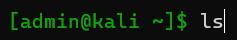
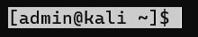
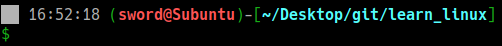

- [1. Symbol](#1-symbol)
- [2. Color](#2-color)
- [3. Advance](#3-advance)
  - [3.1. debian\_chroot](#31-debian_chroot)
  - [3.2. 在 PS1 变量中使用 bash shell 函数](#32-在-ps1-变量中使用-bash-shell-函数)
  - [3.3. 在 PS1 变量中使用 shell 脚本](#33-在-ps1-变量中使用-shell-脚本)
- [4. Summary](#4-summary)
---

# 1. Symbol

- 时间
`\d` ：代表日期，格式为weekday month date，例如："Mon Aug 1" 
`\A` ：`HH:MM`，24小时格式
`\t` ：`HH:MM:SS`，24小时格式
`\T` ：`HH:MM:SS`，12小时格式

- 常用信息：
`\u` ：当前用户的账号名称
`\H` ：完整的主机名称。例如：我的机器名称为：`fc4.linux`，则这个名称就是`fc4.linux` 
`\h` ：仅取主机的第一个名字，如上例，则为`fc4`，`.linux`则被省略
`\W` ：利用basename取得工作目录名称，所以只会列出最后一个目录 
`\w` ：完整的工作目录名称。家目录会以 `~` 代替 
`\\$`(`\$`显示出来还是`$`) ：提示字符，如果是root时，提示符为：`#` ，普通用户则为：`$`

- 其他：
`\!`: 此命令的历史编号
`\#`: 该命令的命令号
`\v`: bash 的版本（例如 5.1）
`\V`: bash 的版本+补丁（例如 5.1.6）
`\s`: shell的名称，如`-bash`。
`\n`: 换行
`\r`: 回到开头
`\[`和`\]`：表示非打印部分


The default PS1 example:
```bash
$ PS1="[\u@\h \w]\$ "
[admin@kali ~]$ ls
```
带个时间
```bash
$ PS1="\t [\u@\h \w]\$ "
20:52:46 [admin@kali ~]$ ls
```

激活:
```bash
$ vim ~/.bashrc
export PS1="\t [\u@\h \w]\$ "

$ source ~/.bashrc
```

# 2. Color
设置PS1变量使提示符成为彩色

Sytax: `\e[F;Bm`（或者使用033替换e，即`\033[F;Bm`）。但你可能还会见到用`\[`和`\]`包裹的形式，`\[\e[F;Bm\]`，这个加括号的才是我们真正使用的。

因为不用括号包裹的话，当PS1中涉及Color这种非打印字符效果时，会出现一个命令错误缓存显示的问题
```bash
# 当你打过长命令时
$ vim hhhhh.txt
$ ls
# 这时你往上翻，会发现长命令的开头还缓存着，显示错误
$ vimls
```

其中`F`为前景颜色（即字体），`B`为背景色，即为下表。
注意：表中这些数字都是不重复的，意味着FB的顺序随便。以及，`F;B`的意思也不是必须有分号，而是有多个F或B的组合（F顶多有一个，B可以有多个）用分号连接的意思，一个F或B就不用分号。

|前景F |背景B |颜色、效果|
|-|-|-|
|30 |40 |黑色|
|31 |41 |红色|
|32 |42 |绿色|
|33 |43 |黃色|
|34 |44 |蓝色|
|35 |45 |紫紅色|
|36 |46 |青蓝色|
|37 |47 |白色|
||0 |OFF|
||1 |高亮前景色|
||3 |斜体|
||4 |underline|
||5 |闪烁|
||7 |反白显示|
||8 |不可见|


所以：

- 开启颜色输出：
  - 单个：
    - 只有前景`\e[Fm`，如绿字`\e[32m`。
    - 只有后景`\e[Bm`，如反白显示`\e[8m`。
  - 组合
    - 绿字白底`\e[32;47m`
    - 绿字白底斜体下划线`\e[32;47;3;4m`
- 关闭颜色输出：`\e[0m`（可以简写为`\e[m`）


```bash
# 绿字
$ PS1="\[\e[32m\][\u@\h \w]$ \[\e[m\]"
```


```bash
# 反白
$ PS1="\[\e[7m\][\u@\h \w]$ \[\e[m\]"
```


```bash
# 绿字白底
$ PS1="\[\e[32;47m\][\u@\h \w]$ \[\e[m\]"
```


```bash
# 绿字白底下划线
$ PS1="\[\e[32;47;3;4m\][\u@\h \w]$ \[\e[m\]"
```


# 3. Advance
## 3.1. debian_chroot

通常，表示：`${var:+value}`

if `$var` is defined; then use 'value'; else do nothing
```bash
$ debian_chroot="$(date +%r)"  
$ PS1="${debian_chroot:+($debian_chroot)}$ "
(05:54:07 AM)$
```


## 3.2. 在 PS1 变量中使用 bash shell 函数
您还可以调用 PS1 中的 bash shell 函数，如下所示。
```bash
$ function httpdcount {
>  ps aux | grep httpd | grep -v grep | wc -l
> }

$ PS1="\u@\h [`httpdcount`]> "
ramesh@dev-db [12]>
[注意：这里显示运行的httpd进程总数]
```
## 3.3. 在 PS1 变量中使用 shell 脚本
您还可以调用 PS1 变量内的 shell 脚本。在下面的示例中，计算当前目录的总文件大小的 `~/bin/totalfilesize.sh` 在 PS1 变量中被调用。
```bash
$ cat ~/bin/totalfilesize.sh

for filesize in $(ls -l . | grep "^-" | awk '{print $5}')
do
  let totalsize=$totalsize+$filesize
done
echo -n "$totalsize"

$ export PATH=$PATH:~/bin
$ PS1="\u@\h [\$(totalfilesize.sh) bytes]> "
ramesh@dev-db [534 bytes]> cd /etc/mail
ramesh@dev-db [167997 bytes]>
```

# 4. Summary

`\n`：换行
`${debian_chroot:+($debian_chroot)}`：chroot
`\[\e[47;5m\]⭕\[\e[m\]`：特殊符号
` \t `：时间
`\[\e[32m\](\[\e[m\]`: 绿色(
`\[\e[31;1m\]\u@\h\[\e[m\]`: 红色用户@主机
`\[\e[32m\])\[\e[m\]`: 绿色)
`-\[\e[32m\][\[\e[m\]`: 绿色[
`\[\e[36;1m\]\w\[\e[m\]`: 青绿色当前目录
`\[\e[32m\]]\n\$\[\e[m\] `: 绿色]，换行，$，空格

⏩

```bash
$ PS1="\n${debian_chroot:+($debian_chroot)}\[\e[47;5m\]⭕\[\e[m\] \t \[\e[32m\](\[\e[m\]\[\e[31;1m\]\u@\h\[\e[m\]\[\e[32m\])\[\e[m\]-\[\e[32m\][\[\e[m\]\[\e[36;1m\]\w\[\e[m\]\[\e[32m\]]\n\$\[\e[m\] "
```
  
