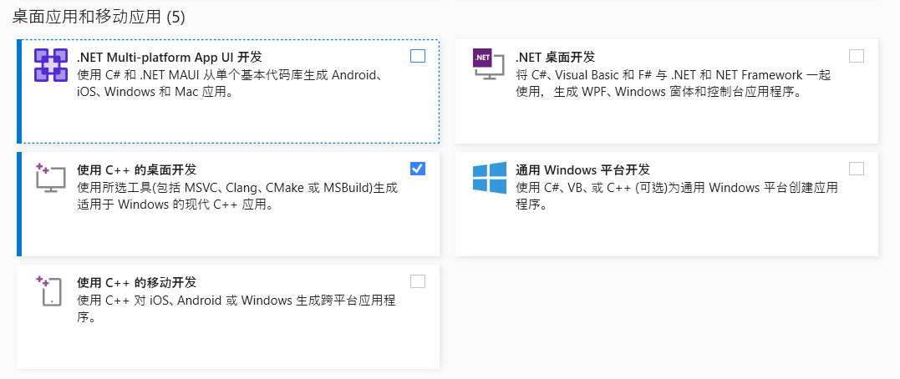
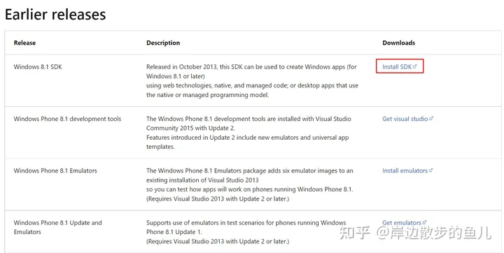
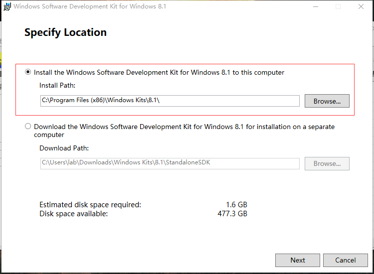

- [1. visual studio](#1-visual-studio)
  - [1.1. cl](#11-cl)
    - [1.1.1. cl.exe, link.exe](#111-clexe-linkexe)
    - [1.1.2. SDK](#112-sdk)
    - [1.1.3. finish](#113-finish)
- [2. mingw \& mingw-w64](#2-mingw--mingw-w64)
  - [2.1. install](#21-install)
- [3. cmake](#3-cmake)


---

- visual studio: cl
- mingw: gcc / g++
- cmake

## 1. visual studio


### 1.1. cl

没有cl而报错
```
subprocess.CalledProcessError: Command '['where', 'cl']' returned non-zero exit status 1.
```

- 安装相关Windows SDK，8.1与10
- 准备三组路径

#### 1.1.1. cl.exe, link.exe

添加环境变量

```
# cl.exe, link.exe --> Path(system)
C:\Program Files\Microsoft Visual Studio\2022\Community\VC\Tools\MSVC\14.37.32822\bin\Hostx64\x64
```
新建一个系统变量 `LIB` 和 `INCLUDE`
```
# LIB
C:\Program Files\Microsoft Visual Studio\2022\Community\VC\Tools\MSVC\14.37.32822\lib\x64
```
```
# INCLUDE
C:\Program Files\Microsoft Visual Studio\2022\Community\VC\Tools\MSVC\14.37.32822\include
```
#### 1.1.2. SDK

https://developer.microsoft.com/en-us/windows/downloads/sdk-archive/

> 8.1





```
# LIB
C:\Program Files (x86)\Windows Kits\8.1\Lib\winv6.3\um\x86
```

> 10(本身是win10就不用下载了，而win11就需要下载)

```
# LIB
C:\Program Files (x86)\Windows Kits\10\Lib\10.0.22621.0\ucrt\x86
# INCLUDE
C:\Program Files (x86)\Windows Kits\10\Include\10.0.22621.0\ucrt
```

#### 1.1.3. finish

运行不成。
```
C:\Program Files\Microsoft Visual Studio\2022\Community\VC\Auxiliary\Build\vcvarsall.bat
```

而其他可以运行成功
```
C:\Program Files\Microsoft Visual Studio\2022\Community\VC\Auxiliary\Build\vcvars32.bat

C:\Program Files\Microsoft Visual Studio\2022\Community\VC\Auxiliary\Build\vcvars64.bat
```
测试
```
D:> cl
用于 x64 的 Microsoft (R) C/C++ 优化编译器 19.37.32825 版
版权所有(C) Microsoft Corporation。保留所有权利。

用法: cl [ 选项... ] 文件名... [ /link 链接选项... ]
```
## 2. mingw & mingw-w64

MinGW和MinGW-W64都是用于Windows平台的轻量级GNU工具链，用于开发和编译C和C++程序。

MinGW（Minimalist GNU for Windows）是一个32位的GNU工具链，它提供了一套基于GNU的开发环境，包括GCC编译器和一些GNU库，可以用来编译Windows下的C和C++程序。但MinGW只支持32位程序的编译。

MinGW-W64是一个64位的GNU工具链，是MinGW的升级版，原本它是MinGW的分支，后来成为独立发展的项目，它支持同时编译32位和64位程序。它包括了一系列的GNU库和工具，例如GCC、Binutils、**GDB**等，还支持一些实用工具和库，如OpenMP、MPI等。

总的来说，MinGW-W64可以看作是MinGW的升级版，它支持更多的编译选项和更多的库，可以编译出更加高效和安全的程序。

另外，MinGW-W64原本是从MinGW项目fork出来的独立的项目。MinGW 早已停止更新，内置的GCC最高版本为4.8.1，而MinGW-W64目前仍在维护，它也是GCC官网所推荐的。

### 2.1. install

[msys2](https://www.msys2.org/)

```bash
pacman -S --needed base-devel mingw-w64-ucrt-x86_64-toolchain
```

环境变量：MinGW-w64 `msys64/ucrt64/bin`

```
gcc --version
g++ --version
gdb --version
```

[sourceforge, 太老了8.1.0](https://sourceforge.net/projects/mingw-w64/files/)

## 3. cmake

https://cmake.org/download/

环境变量：`D:\Applications\cmake\bin`

```
(base) PS C:\Users\lab> cmake --version
cmake version 3.28.0-rc3

CMake suite maintained and supported by Kitware (kitware.com/cmake).
```
