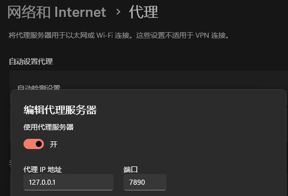

---

## ssh config


替换 github.com 的 HostName 来找到


1. 上默认

    一般用 `ssh.github.com` 就可以找到
    ```bash
    $ sudo vim /home/sword/.ssh/config
    Host github.com
        # >>>>>>>>>>>>>>>>>>>
        HostName ssh.github.com
        PreferredAuthentications publickey
        IdentityFile /home/sword/.ssh/id_rsa
    ```

2. 精准域名

    ```bash
    $ sudo vim /home/sword/.ssh/config
    Host github.com
        # >>>>>>>>>>>>>>>>>>>
        HostName 140.82.113.4
        PreferredAuthentications publickey
        IdentityFile /home/sword/.ssh/id_rsa
    ```

    ```bash
    # 域名污染, 找不到 github.com
    $ ssh -vT git@github.com
    OpenSSH_8.9p1 Ubuntu-3ubuntu0.3, OpenSSL 3.0.2 15 Mar 2022
    debug1: Reading configuration data /home/sword/.ssh/config
    debug1: Reading configuration data /etc/ssh/ssh_config
    debug1: /etc/ssh/ssh_config line 19: include /etc/ssh/ssh_config.d/*.conf matched no files
    debug1: /etc/ssh/ssh_config line 21: Applying options for *
    ssh: Could not resolve hostname github.com: Temporary failure in name resolution

    $ ping ssh.github.com
    Ping 请求找不到主机 ssh.github.com。请检查该名称，然后重试。
    ```

    如果出现了意外情况，那么只能手动[查找域名](https://myssl.com/dns_check.html)

      
    ```bash
    $ ping 140.82.113.4

    正在 Ping 140.82.113.4 具有 32 字节的数据:
    来自 140.82.113.4 的回复: 字节=32 时间=278ms TTL=43
    来自 140.82.113.4 的回复: 字节=32 时间=296ms TTL=43
    来自 140.82.113.4 的回复: 字节=32 时间=309ms TTL=43
    来自 140.82.113.4 的回复: 字节=32 时间=286ms TTL=43
    ```


## 梯子 和 proxy

问题：
- `git clone https://github.com/sword4869/mytree.git`一直卡住
- `pip install "git+https://github.com/facebookresearch/pytorch3d.git"`: 报错`GnuTLS recv error (-110): The TLS connection was non-properly terminated`

### 1.2.1. windows

1. 这玩意是要你开梯子才有用。
   
   查看梯子的端口号
   
     


2. 设置git的端口号
   
    ```bash
    # set proxy
    git config --global http.proxy http://127.0.0.1:7890
    git config --global https.proxy https://127.0.0.1:7890
    ```


    ```bash
    # delete proxy
    git config --global --unset http.proxy
    git config --global --unset https.proxy
    ```

不开梯子了，`http.proxy` 和 `https.proxy` 好像不用删，git也能正常联网。


### 1.2.2. wsl

1. clash打开 "允许局域网链接入Clash"

2. 查ip
   
   使用WSL的ip `172.23.208.1` (在windows下查看wsl的ip）

    ```bash
    windows C:> ipconfig
    以太网适配器 vEthernet (WSL):

      连接特定的 DNS 后缀 . . . . . . . :
      本地链接 IPv6 地址. . . . . . . . : fe80::8022:9324:43f6:274e%30
      IPv4 地址 . . . . . . . . . . . . : 172.23.208.1
      子网掩码  . . . . . . . . . . . . : 255.255.240.0
    ```
   注意：既不是在linux下查看的`172.23.208.218`)，也不是在windows下查看windows的ip`192.168.3.96`
    ```bash
    windows C:> ipconfig
    无线局域网适配器 WLAN:

      连接特定的 DNS 后缀 . . . . . . . :
      本地链接 IPv6 地址. . . . . . . . : fe80::e526:6faa:9d03:fb5a%12
      IPv4 地址 . . . . . . . . . . . . : 192.168.3.96
      子网掩码  . . . . . . . . . . . . : 255.255.255.0
      默认网关. . . . . . . . . . . . . : 192.168.3.1

    wsl$ ifconfig
    eth0: flags=4163<UP,BROADCAST,RUNNING,MULTICAST>  mtu 1500
            inet 172.23.208.218  netmask 255.255.240.0  broadcast 172.23.223.255
            inet6 fe80::215:5dff:fe3e:8516  prefixlen 64  scopeid 0x2
    ```
3. 全局 proxy
    ```bash
    export http_proxy=http://172.23.208.1:7890
    export https_proxy=https://172.23.208.1:7890
    ```
    测试
    ```bash
    curl -vv http://google.com
    curl -vv https://google.com
    ```
    代理失败
    ```bash
    (base) lab@eleven:~$ curl -vv http://google.com
    *   Trying 172.217.163.46:80...
    ```
    代理成功
    ```bash
    (base) lab@eleven:~$ curl -vv http://google.com
    * Uses proxy env variable http_proxy == 'http://172.23.208.1:7890'
    *   Trying 172.23.208.1:7890...
    * Connected to (nil) (172.23.208.1) port 7890 (#0)
    > GET http://google.com/ HTTP/1.1
    > Host: google.com
    > User-Agent: curl/7.81.0
    > Accept: */*
    > Proxy-Connection: Keep-Alive
    > 
    * Mark bundle as not supporting multiuse
    < HTTP/1.1 301 Moved Permanently
    < Content-Length: 219
    < Cache-Control: public, max-age=2592000
    < Connection: keep-alive
    < Content-Security-Policy-Report-Only: object-src 'none';base-uri 'self';script-src 'nonce-Fz0c0wP75KecYUsvutJc2w' 'strict-dynamic' 'report-sample' 'unsafe-eval' 'unsafe-inline' https: http:;report-uri https://csp.withgoogle.com/csp/gws/other-hp
    < Content-Type: text/html; charset=UTF-8
    < Date: Mon, 14 Aug 2023 03:29:44 GMT
    < Expires: Wed, 13 Sep 2023 03:29:44 GMT
    < Keep-Alive: timeout=4
    < Location: http://www.google.com/
    < Proxy-Connection: keep-alive
    < Server: gws
    < X-Frame-Options: SAMEORIGIN
    < X-Xss-Protection: 0
    < 
    <HTML><HEAD><meta http-equiv="content-type" content="text/html;charset=utf-8">
    <TITLE>301 Moved</TITLE></HEAD><BODY>
    <H1>301 Moved</H1>
    The document has moved
    <A HREF="http://www.google.com/">here</A>.
    </BODY></HTML>
    * Connection #0 to host (nil) left intact
    ```
    ```bash
    # vim ~/.bashrc
    alias proxyon="export http_proxy=http://172.23.208.1:7890 && export https_proxy=https://172.23.208.1:7890" 
    alias proxyoff="unset http_proxy && unset https_proxy"
    alias proxytest="curl -vv http://google.com && curl -vv https://google.com"
    ```
5. git proxy

    ```bash
    git config --global http.proxy $http_proxy
    git config --global https.proxy $https_proxy

    (base) lab@eleven:~$ git config --global --list
    user.name=sword4869
    user.email=xxxxxxxxxxxxxxxxxx
    http.proxy=http://172.23.208.1:7890
    https.proxy=https://172.23.208.1:7890
    ```
