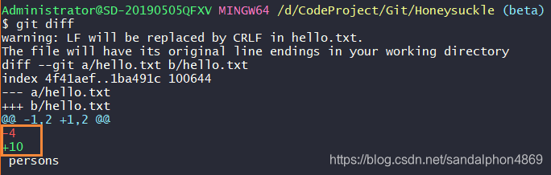

- [1. branch](#1-branch)
  - [1.1. add list remove](#11-add-list-remove)
  - [1.2. switch branch](#12-switch-branch)
  - [1.3. rename a branch](#13-rename-a-branch)
  - [1.4. merge](#14-merge)

# 1. branch

## 1.1. add list remove

add a branch

```bash
# git branch <branch>
$ git branch orange
```

创建分支的效果相当于虚拟机的快照。
PS：注意是对当前的 **commit到本地仓库中的** 的文件进行镜像。

> show branch

```bash
$ git branch
* main
  orange
```

`git branch`列出的分支前带 `*`号的表示当前分支。

> remove branch

```bash
# 同当前分支一样，即merge过的，那么就不会error
$ git branch -d <branch>

# 同当前分支不一样，所以要强制删除
$ git branch -D <branch>
```

## 1.2. switch branch

```bash
$ git checkout orange
Switched to branch 'orange'
M       branch.md
M       config.md
D       renmote.md
```

当你切换到某分支时，工作目录下的文件就是那个分支 **commit到本地仓库中的** 的文件。

PS: 切换分支要求你工作区和暂存区没有东西。

```bash
# add a branch and switch to it. `-b` means branch.
$ git checkout -b <branch>
```

## 1.3. rename a branch

```bash
$ git branch -M main
```

```
-M: 
Shortcut for --move --force.

-m/--move:
Move/rename a branch, together with its config and reflog.

-f/--force
Reset <branchname> to <startpoint>, even if <branchname> exists already. Without -f, git branch refuses to change an existing branch. In combination with -d (or --delete), allow deleting the branch irrespective of its merged status, or whether it even points to a valid commit. In combination with -m (or --move), allow renaming the branch even if the new branch name already exists, the same applies for -c (or --copy).
```

i.e. 想要重命名已存在的分支，重命名是 `-m`，而修改已存在需要 `--force`，`-M = -m -f`。

## 1.4. merge

```bash
$ git merge <other branch>
```

git的主要工作流程就是，大家提交不同的分支，然后将其融合到主分支上，一起维护一个主分支。

所以，merge的意思不是当前分支被别的分支融合，而是当前分支吞噬别的分支（别的分支被当前分支融合后，别的分支消失，只剩下当前分支）。

Rules:

- 某分支中有的，当前分支中没有：则添加到当前分支。
- √某分支中没有的，当前分支中有：则**删除**当前分支中的。
- 某分支中有的，当前分支中没有：如无不同，则无事。如有不同，则冲突。

使用 `git diff`查看冲突之处。会用 `-`、`+`和红绿颜色标识。

