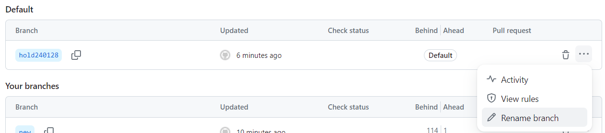

- [1. remote](#1-remote)
  - [1.1. show names of remote repository](#11-show-names-of-remote-repository)
  - [1.2. add and remove](#12-add-and-remove)
    - [1.2.1. add a remote repository](#121-add-a-remote-repository)
    - [1.2.2. remove a remote repository](#122-remove-a-remote-repository)
  - [1.3. push](#13-push)
    - [1.3.1. 推送](#131-推送)
    - [1.3.2. 删除](#132-删除)
    - [1.3.3. 默认](#133-默认)
    - [1.3.4. 强制更新（合并冲突的问题）](#134-强制更新合并冲突的问题)
    - [1.3.5. Github清除历史记录](#135-github清除历史记录)
  - [1.4. pull = fetch + merge](#14-pull--fetch--merge)
    - [1.4.1. pull](#141-pull)
    - [1.4.2. fetch](#142-fetch)
    - [1.4.3. 远程分支](#143-远程分支)

# 1. remote
## 1.1. show names of remote repository

```bash
$ git remote
origin

$ git remote -v
origin  https://gitee.com/sandalphon/weather_predict.git (fetch)
origin  https://gitee.com/sandalphon/weather_predict.git (push)

# 没有远程仓库
$ git remote
fatal: not a git repository (or any of the parent directories): .git
```
## 1.2. add and remove

### 1.2.1. add a remote repository

```bash
# git remote add <remote repository name> <remote repository url>
$ git remote add origin https://gitee.com/sandalphon/weather_predict.git
```

### 1.2.2. remove a remote repository

```bash
$ git remote remove origin
```

## 1.3. push

### 1.3.1. 推送

1. 【分支同名】

```bash
# git push <remote repository name> <local branch name>
$ git push origin master
```

将 `本地的分支`推送到 `远程仓库`的 `同本地分支名`。

两种情况：远程仓库有，则更新。没有，则创建一个新的同名分支。

2. 【分支异名】

```bash
# git push <remote repository name> <local branch name>:<remote branch name>
$ git push origin master:main
```
### 1.3.2. 删除
3. 【删除远程仓库的某远程分支】

```bash
# git push <remote repository name> :<remote branch name>
$ git push origin :main
```

相当于推送空本地分支，自然效果就是删除。

```bash
# 例如
git push origin :master
# 等同于
git push origin --delete master
```
###  1.3.3. 默认
- 【默认 the current branch】

```bash
# git push <remote repository name>
$ git push origin
```

默认当前分支。

- 【默认化 remote repository】

```bash
# git push -u <remote repository name> [<local branch name>]
$ git push -u origin [master]
```

将 `本地的分支`推送到 `远程仓库`，同时指定 `远程仓库`为 `默认的远程仓库`，后面就可以不加任何参数使用 `git push`了。

```bash
# 将当前分支推送到默认远程仓库
$ git push
```

只有当默认指定 `远程仓库`后，才能使用！

### 1.3.4. 强制更新（合并冲突的问题）

- 使用此命令告诉 git 允许不相关历史合并

  这样就能把远程文件拉取回来。执行此命令后会有一个提示，要求说明为何要讲两个不相关的分支合并，输入信息后保存即可。

```bash
$ git pull origin master –allow-unrelated-histories
$ git push origin master
```

- 强制将本地文件推送至远程

  **这样会将远程仓库的master分支的历史文件都清掉**。从而不会产生因为合并冲突的问题.
  PS：建议使用此命令前备份一个远程分支：先本地创建一个分支，拉去远程分支，再push一个新的分支，最后再push到那原来的分支。

```bash
$ git push origin master -f
```

- push到一个新的远程分支。

```bash
$ git push origin master:master2
```

### 1.3.5. Github清除历史记录

1. 孤儿分支
  
  ```bash
  git checkout --orphan new
  git add .
  git commit -m 'init'
  ```

2. push 孤儿分支

```bash
git push origin new
```

3. 管理默认分支，将原本的默认分支设置为孤儿分支

  

4. 删除原本分支

```bash
git push origin :main
```

5. 有兴趣再重命名一下分支

## 1.4. pull = fetch + merge

### 1.4.1. pull

基本用法：``git pull <remote repository> <remote branch>:<local branch>``。

- 例如执行下面语句：`git pull origin master:brantest`，将远程主机origin的master分支拉取过来，与本地的brantest分支合并。
- 后面的冒号可以省略：`git pull origin master`。表示将远程origin主机的master分支拉取过来和本地的**当前分支**进行合并。

`git pull = git fetch + git merge`。上面的pull操作`git pull origin master`用fetch表示为：

```bash
git fetch origin master
git merge origin/master
```

相比起来git fetch更安全一些，因为在merge前，我们可以查看更新情况，然后再决定是否合并。


### 1.4.2. fetch

结果是在本地仓库创建一个本地分支 `<remote repository>/<remote branch>`。但并不会在 `git branch`中显示。
e.g.

```bash
# git fetch <remote repository> <remote branch>
$ git fetch origin master
 * branch            master     -> FETCH_HEAD
   d48f66c..ee96b01  master     -> origin/master

# 但并不会在`git branch`中显示。
$ git branch
* master

$ git diff

$ git merge origin/master
```
### 1.4.3. 远程分支

- 当本地没有其他分支的代码仓库时

  ```bash
  # 默认分支
  git clone origin
  # 指定分支
  git clone -b 分支名 origin
  ```
  执行上述命令后就将远程分支拉取到了本地。

- 当本地有其他分支的代码仓库时, 查看所有的远程分支

  ```bash
  $ git branch -r
    origin/docs
    origin/modern
    origin/residual
  ```
  
  + 不需要本地分支和远程分支建立映射关系

    ```bash
    git fetch origin 远程分支名xxx:本地分支名xxx
    ```

    使用这种方式会在本地仓库新建分支xxx，但是并不会自动切换到新建的分支xxx，需要手动checkout。然后远程分支xxx的代码也拉取到了本地分支xxx中。采用这种方法建立的本地分支不会和远程分支建立映射关系。

  + 需要本地分支和远程分支建立映射关系

    ```bash
    git checkout -b 本地分支名xxx origin/远程分支名xxx
    ```

    使用这种方式会在本地仓库新建分支xxx，并自动切换到新建的分支xxx。然后远程分支xxx的代码也拉取到了本地分支xxx中。采用这种方法建立的本地分支会和远程分支建立映射关系。

