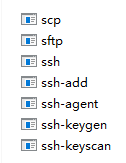
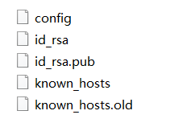
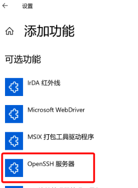
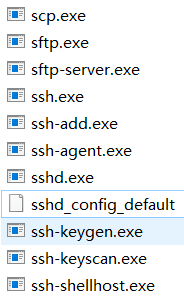

- [1. openssh](#1-openssh)
  - [1.1. 前言](#11-前言)
  - [1.2. Usage](#12-usage)
    - [1.2.1. scp传文件](#121-scp传文件)
  - [1.3. 两种认证机制](#13-两种认证机制)
    - [1.3.1. 密码认证](#131-密码认证)
    - [1.3.2. 密钥认证](#132-密钥认证)
  - [1.4. linux](#14-linux)
    - [1.4.1. 安装](#141-安装)
    - [1.4.2. ssh client](#142-ssh-client)
    - [1.4.3. Client便捷登录别人](#143-client便捷登录别人)
    - [1.4.4. Server定义允许谁进来](#144-server定义允许谁进来)
    - [1.4.5. Server Start](#145-server-start)
      - [1.4.5.1. service 启动](#1451-service-启动)
      - [1.4.5.2. 脚本启动](#1452-脚本启动)
      - [1.4.5.3. 原生启动](#1453-原生启动)
  - [1.5. windows](#15-windows)
    - [1.5.1. client](#151-client)
    - [1.5.2. server](#152-server)
    - [1.5.3. sshpass解决输密码](#153-sshpass解决输密码)
  - [1.6. 登陆问题](#16-登陆问题)
    - [1.6.1. WARNING: REMOTE HOST IDENTIFICATION HAS CHANGED!](#161-warning-remote-host-identification-has-changed)
    - [1.6.2. WARNING: UNPROTECTED PRIVATE KEY FILE!](#162-warning-unprotected-private-key-file)
    - [1.6.3. github](#163-github)
    - [1.6.4. 使用 SSH 连接报 Bad owner or permissions on C:\\Users\\Administrator/.ssh/config 错误问题解决](#164-使用-ssh-连接报-bad-owner-or-permissions-on-cusersadministratorsshconfig-错误问题解决)
  - [1.7. 其他ssh实例](#17-其他ssh实例)
  - [1.8. 端口转发](#18-端口转发)
---


# 1. openssh
## 1.1. 前言

与`telnet`、 `rlogin`、`FTP`明文传输不同，SSH可以对所有传输的数据进行加密，能够防止 DNS 欺骗和 IP 欺骗。


让ssh不安全的妙招:
- 使用密码登陆，可能会被冒充主机骗到，也可能被暴力破解，建议密钥
- 使用22端口，可能会被扫网，建议换成别的。
- 公私钥被窃取后，服务器就判断不出来了。
- Server的配置`PermitRootLogin`，禁止直接以root登陆的话`no`，那么就可以避免扫网，因为这样必须得知道你的普通用户名是什么(可能是coco，也可能是cola，而不是每台机子都有的root)。


## 1.2. Usage
### 1.2.1. scp传文件

```bash
usage: scp [-346BCpqrv] [-c cipher] [-F ssh_config] [-i identity_file]
           [-l limit] [-o ssh_option] [-P port] [-S program] 
           source ... target

-l 网速限制
-P 端口
-r 递归文件
```

```bash
# file
$ scp usersomeone@192.168.135.83:~/wikiart.tar.gz .

# directory
$ scp -r usersomeone@192.168.135.83:~/Downloads .
```
## 1.3. 两种认证机制

一种是用户密码的方式，另一种是密钥验证的方式

### 1.3.1. 密码认证
过程：
1. client向server发起登录请求，client 收到返回的 server公钥
2. client输入密码，密码经client获得的server公钥加密后发送到server
3. server接收到加密密码后使用 server私钥解密，如果密码正确则登录成功

配置需求：
- server要生成自己的私钥和公钥，client不需要配置

```bash
# 以用户coco，登陆server
ssh coco@192.168.112.130

The authenticity of host 'host (12.18.429.21)' can't be established.
RSA key fingerprint is 98:2e:d7:e0:de:9f:ac:67:28:c2:42:2d:37:16:58:4d.
Are you sure you want to continue connecting (yes/no)?
```

这是第一步server发来的公钥的公钥指纹（公钥的摘要），**让用户自行核对**。因为有一种攻击方式，骇客冒充服务器端，所以你需要手动核对这个公钥指纹是不是真的。

### 1.3.2. 密钥认证
过程：
1. client发起密钥连接请求，并上传 client公钥。
2. server收到 client公钥后，在可信列表文件`~/.ssh/authorized_keys`中查询此公钥，若无此client则断开连接，否则发送一串随机问询码（问询码用此client公钥加密处理）
3. client收到加密问询码后，使用client私钥解密出问询码再用通信session对问询码加密并传送给server
4. server解密问询码并判定client身份安全与否，安全则建立连接

配置需求：
- client配置自己的私钥和公钥
- client将client公钥上传到server的可信列表文件中。

登陆步骤：前两步是第一次配置才需要

> 密钥

- 如果到时候client用密码认证，那么只需要server生成公私钥。


> 配置

1. 生成密钥对: `id_rsa`是私钥，`id_rsa.pub`是公钥（其实都是文本文件）

    ```bash
    $ ssh-keygen
    Generating public/private rsa key pair.
    Enter file in which to save the key (/home/sword/.ssh/id_rsa): 
    【这里告诉你默认生成的位置，直接一路Enter】
    Enter passphrase (empty for no passphrase): 
    Enter same passphrase again: 
    Your identification has been saved in /home/sword/.ssh/id_rsa
    Your public key has been saved in /home/sword/.ssh/id_rsa.pub
    The key fingerprint is:
    SHA256:b1pwv7wBG1IOrznkNsAc1ZAfYwXwoCK50wlU9/b7/PQ sword@sword
    The key's randomart image is:
    +---[RSA 3072]----+
    |  ... . ==.o.    |
    | . . . +.o=      |
    |  + . o +ooo     |
    |   = = o *.      |
    |  o o + S B      |
    |   .   + B *     |
    |        B * o .  |
    |       . * + + . |
    |        .   *o. E|
    +----[SHA256]-----+
    ```
    默认采取rsa，换成别的`[-t dsa | ecdsa | ed25519 | rsa]`, 比如dsa，就是`ssh-keygen -t dsa`.


2. 录入server的可信列表中

    ```bash
    # client上传公钥到 server ，被放到 server 的~/.ssh/authorized_keys中
    # 方法1
    $ ssh-copy-id coco@192.168.112.130

    # 方法2
    $ scp ~/.ssh/id_rsa.pub coco@192.168.112.130:~/.ssh/authorized_keys
    # 或者在server上 $ cat ~/.ssh/id_rsa.pub >> ~/.ssh/authorized_keys
    ```

    PS: 
    kali下普通用户的`~`是`/home/user`，root的`~`是`/root`。`~/.ssh`, 普通用户时在`/home/user/.ssh`中，root在`/root/.ssh`中。

    client生成密钥对是client系统登陆的`~`；
    
    公钥被上传到server也是server系统登陆的`~`；
    
    server 查client公钥也是`~/.ssh/authorized_keys`是根据server要登陆的`~`，比如`ssh co@192.168.1.100`是`/home/co/.ssh/authorized_keys`，`ssh root@192.168.1.100`是`/root/.ssh/authorized_keys`。

## 1.4. linux

### 1.4.1. 安装


Linux：默认有client, 但没有server

```bash
# client
sudo apt install openssh-client
# server
sudo apt install openssh-server
```

Configuration：
- client时
  - `~/.ssh/config`：ssh 配置文件。
  - `~/.ssh/known_hosts`：已知 server 列表。
  - `~/.ssh/id_rsa`：`ssh-keygen`生成的私钥。
  - `~/.ssh/id_rsa.pub`：`ssh-keygen`生成的公钥。
- server:
  - `/etc/ssh/sshd_config`：sshd 配置文件。
  - `~/.ssh/authorized_keys`： 可信client列表。

### 1.4.2. ssh client

```bash
usage: ssh [-46AaCfGgKkMNnqsTtVvXxYy] [-B bind_interface]
           [-b bind_address] [-c cipher_spec] [-D [bind_address:]port]
           [-E log_file] [-e escape_char] [-F configfile] [-I pkcs11]
           [-i identity_file] [-J [user@]host[:port]] [-L address]
           [-l login_name] [-m mac_spec] [-O ctl_cmd] [-o option] [-p port]
           [-Q query_option] [-R address] [-S ctl_path] [-W host:port]
           [-w local_tun[:remote_tun]] destination [command]
```
```bash
# 以端口2222登陆
ssh -p 2222 coco@192.168.112.130
```

`coco@192.168.112.130`就是`destination`（user@hostname）. 只有`192.168.112.130`的话，就是以client的当前用户名登陆。

`command`：一次性执行后退出远程登陆返回本机，而不是持久挂载shell。如`ssh coco@192.168.112.130 ls`。

### 1.4.3. Client便捷登录别人

这个用于将经常登录的帐号记录下来, 像快捷方式一样便捷使用.

```bash
vim ~/.ssh/config
# 或者直接修改根配置文件 vim /etc/ssh/ssh_config
# 优先级是`~/.ssh/config`高，然后是`/etc/ssh/ssh_config`。
```


```bash
# 这是配置的匹配名字 alias
Host co
  # 用户名
  User coco
  # 实际的host地址
  HostName 192.168.112.130
  # 登陆端口，默认22就不用写
  Port 7222
  # 私钥，选了这个就不能密码登陆
  IdentityFile ~/.ssh/id_rsa
```

```bash
$ ssh co
```
注意：这里找co是在 `~/.ssh/config` 中找，当你（是client系统登陆的，而不是config中的User）是在普通用户时，在`/home/user/.ssh/config`找；当你是root时在`/root/.ssh/config`找。或者你可以指定位置， `ssh -F File destination`。
这么就会出现一个问题，如果config创建在`/home/user/.ssh/config`时，而你用`sudo ssh co`，那么就会去`/root/.ssh/config`找，还非得你退出root权限。修改`/etc/ssh/ssh_config`的好处是，避免出现这种情况。


PS：限制只使用某种方式登陆 `PreferredAuthentications`
```bash
# 默认允许三种方式
PreferredAuthentications keyboard-interactive,password,publickey

# 只允许使用密钥
PreferredAuthentications publickey
```
### 1.4.4. Server定义允许谁进来

> sshd 配置文件

```bash
# 这个是sshd读取的默认配置文件
sudo vim /etc/ssh/sshd_config
```

```bash
#Port 22

#HostKey /etc/ssh/ssh_host_rsa_key
#HostKey /etc/ssh/ssh_host_ecdsa_key
#HostKey /etc/ssh/ssh_host_ed25519_key

#PermitRootLogin prohibit-password

#PubkeyAuthentication yes

#PasswordAuthentication yes
```
```bash
Port 7222

HostKey /home/sword/.ssh/id_rsa

PermitRootLogin prohibit-password

PubkeyAuthnentication yes

PasswordAuthentication yes
```

- `Port`端口：建议换成7222之类的
- `HostKey`私钥：默认采用的是`/etc/ssh/ssh_host_ecdsa_key`, `/etc/ssh/ssh_host_ed25519_key`, `/etc/ssh/ssh_host_rsa_key`（碰到好几次系统初始化生成的这些都登不上，一定要自己用`ssh-keygen`生成`/home/sword/.ssh/id_rsa`下的。（`/etc/init.d/ssh`开启后是以`root`权限执行`/usr/sbin/sshd`的，所以注意`~`的问题，建议直接写成绝对路径。）
- `PermitRootLogin`直接root登陆：
  - `prohibit-password`（默认，不能用密码登陆root账户，只能用公私钥登陆root），
  - `yes`（都行），
  - `forced-commands-only`(只能`ssh destination command`的形式登陆root)，
  - `no`（禁止直接以root登陆，可以先登陆用户再sudo提升权限）

三种登陆选择：
- 只用密码：
  ```bash
  PubkeyAuthnentication no
  PasswordAuthentication yes
  ```
  （`HostKey`就不用管了）。PS：`$ passwd`是你没设Linux当前用户的密码下才搞的，这密码不是ssh特定的。
- 只用密钥：
  ```bash
  PubkeyAuthnentication yes
  PasswordAuthentication no
  ```
  `HostKey`还要设定好。
- 先密钥再密码（默认）：
  ```bash
  PasswordAuthentication yes
  PubkeyAuthnentication yes
  ```
  `HostKey`还要设定好。
  这样会先让你密钥登陆，不行的话再密码登陆。

配置完成后，要重新加载配置文件才生效：

```bash
sudo service ssh reload

sudo /etc/init.d/ssh reload
```


### 1.4.5. Server Start

#### 1.4.5.1. service 启动

启动
```bash
sudo service ssh start
```

查看是否启动
```bash
sudo service ssh status

# 方法2
ps -e | grep ssh
```

关闭
```bash
sudo service ssh stop

# 方法2
$ ps -e | grep ssh                         
    910 ?        00:00:00 ssh-agent
   1873 ?        00:00:00 sshd
$ kill 1873   
```


#### 1.4.5.2. 脚本启动

`/etc/init.d/ssh`


这个其实就是个脚本，将上面`sshd`的功能包装了一下，把一些命令按照用途分成了几个功能，省得你多写字。一般我们都是通过这个来启动sshdserver，而不是敲复杂的`sshd xxx`命令。
```bash
Usage: /etc/init.d/ssh {start|stop|reload|force-reload|restart|try-restart|status}.
```

注意：这个脚本开启后是以`root`权限执行`/usr/sbin/sshd`的，所以注意`~`的问题，建议直接写成绝对路径。

PS：`/etc/init.d/`大多数是`ssh`，有的极个别的(IOS的ish)是`sshd`


```bash
# 启动
sudo /etc/init.d/ssh start

# 状态
sudo /etc/init.d/ssh status
```

#### 1.4.5.3. 原生启动

```bash
usage: sshd [-46DdeiqTt] [-C connection_spec] [-c host_cert_file]
            [-E log_file] [-f config_file] [-g login_grace_time]
            [-h host_key_file] [-o option] [-p port] [-u len]

$ sshd
sshd re-exec requires execution with an absolute path
【需要加上路径`/xxx/sshd xxx`。可以通过`which sshd`来寻找路径。】

$ which sshd          
/usr/sbin/sshd

$ /usr/sbin/sshd
sshd: no hostkeys available -- exiting.
【这是要我们的密钥对的私钥】
【默认文件是/etc/ssh/ssh_host_ecdsa_key, /etc/ssh/ssh_host_ed25519_key and /etc/ssh/ssh_host_rsa_key.】
【三者分别表示三种类型，选择其一即可。但是这些其实未被初始化，都是空的！！！】
【我们之前ssh-keygen，不是生成了/home/sword/.ssh/id_rsa，拿这搞】

$ /usr/sbin/sshd -h /home/sword/.ssh/id_rsa
【已经开启server了】
【或者直接修改默认配置文件/etc/ssh/sshd_config，`HostKey /home/sword/.ssh/id_rsa`】
```
```bash
# sshd启动的，只能杀死进程
$ ps -e | grep ssh
    987 ?        00:00:00 ssh-agent
   1505 ?        00:00:00 sshd
$ kill 987 1505
```

- 直接启动sshd程序后，`sudo service status`看不到启动，只能用`ps -e | grep ssh`确认是否启动。
- 直接启动sshd程序后，`sudo service stop`关不掉，只能`kill`
- 直接启动sshd程序后，如果没有kill，那么`sudo service ssh start`就会因为矛盾而启动失败。
## 1.5. windows

### 1.5.1. client
OpenSSH 已添加至Windows 10：`C:\Windows\System32\OpenSSH`。
  


创建`C:\Users\xxx\.ssh\config`文件.

`cat > config`创建空后缀的空文件, 直接`notepad config`的后缀是`.txt`.

> 其他

`ssh-keygen`生成的密钥、本机充当client的登陆文件`config`、`known_hosts`都在windows在`C:\Users\xxx\.ssh`下


### 1.5.2. server
> 安装

默认没装, 去windows设置的【应用】【可选功能】【添加功能】【OpenSSH 服务器】
  

会多出服务器的程序


`cat > sshd_config_default`创建空后缀的空文件, `sshd_config_default`是本机充当server的配置文件。

> 启动服务器
```bash
# 需要以管理员身份打开cmd
net start sshd
net stop sshd

# 也可以原生sshd程序启动。
```
> 自启动

windows shell:startup xxx.bat
```bash
%1 mshta vbscript:CreateObject("Shell.Application").ShellExecute("cmd.exe","/c %~s0 ::","","runas",1)(window.close)&&exit

net stop sshd
net start sshd
```

### 1.5.3. sshpass解决输密码

```bash
sudo apt install sshpass
sshpass -p PASSWORD ssh user@hostname
```
甚至可以起个别名
```bash
gedit ~/.bashrc
alias hpc='sshpass -p PASSWORD ssh user@hostname'
source ~/.bashrc
hpc
```

## 1.6. 登陆问题
### 1.6.1. WARNING: REMOTE HOST IDENTIFICATION HAS CHANGED!

这里要登陆的 server 变化了，因为你 client 本地存有以前记住的 server 的 hostname，所以发现不匹配后的问题。解决办法就是删除**client**中的 `~/.ssh/known_hosts` 的对应的服务器ip的记录。

### 1.6.2. WARNING: UNPROTECTED PRIVATE KEY FILE!
```bash
$ /usr/sbin/sshd -h /home/sword/.ssh/id_rsa
@@@@@@@@@@@@@@@@@@@@@@@@@@@@@@@@@@@@@@@@@@@@@@@@@@@@@@@@@@@
@         WARNING: UNPROTECTED PRIVATE KEY FILE!          @
@@@@@@@@@@@@@@@@@@@@@@@@@@@@@@@@@@@@@@@@@@@@@@@@@@@@@@@@@@@
Permissions 0644 for '/home/sword/.ssh/known_hosts' are too open.
It is required that your private key files are NOT accessible by others.
This private key will be ignored.
Unable to load host key "/home/sword/.ssh/known_hosts": bad permissions
Unable to load host key: /home/sword/.ssh/known_hosts
sshd: no hostkeys available -- exiting.
【这个情况是说/home/sword/.ssh/id_rsa的文件权限太开放，容易被骇客入侵，我们修改权限就行】

# 调整私钥的文件权限
$ chmod 0600 /home/sword/.ssh/id_rsa
```
### 1.6.3. github

都是一个问题：
> - ssh: connect to host github.com port 22: Connection refused
>
> - fatal: unable to access 'https://github.com/telesoho/vscode-markdown-paste-image.git/': SSL certificate problem: unable to get local issuer certificate
>
> - Cloning into 'development_configurations'...
git@ssh.github.com: Permission denied (publickey).
fatal: Could not read from remote repository.
Please make sure you have the correct access rights
and the repository exists.
>
> - git@ssh.github.com: Permission denied (publickey).
>
> - ssh: connect to host github.com port 22: Connection timed out

这都是梯子问题。

1. 尝试git。https一般会屏蔽，git基本不会。

    从`git clone https://github.com/telesoho/vscode-markdown-paste-image.git`
    
    变成`git clone git@github.com:telesoho/vscode-markdown-paste-image.git`

2. 域名污染
    ```bash
    # 找不到 github.com
    $ ssh -vT git@github.com
    OpenSSH_8.9p1 Ubuntu-3ubuntu0.3, OpenSSL 3.0.2 15 Mar 2022
    debug1: Reading configuration data /home/sword/.ssh/config
    debug1: Reading configuration data /etc/ssh/ssh_config
    debug1: /etc/ssh/ssh_config line 19: include /etc/ssh/ssh_config.d/*.conf matched no files
    debug1: /etc/ssh/ssh_config line 21: Applying options for *
    ssh: Could not resolve hostname github.com: Temporary failure in name resolution
    ```
    一般用 `ssh.github.com` 就可以找到
    ```
    # 替换 github.com 的 HostName 来找到
    $ sudo vim /home/sword/.ssh/config
    Host github.com
        HostName ssh.github.com
        PreferredAuthentications publickey
        IdentityFile /home/sword/.ssh/id_rsa
    ```
    ```bash
    $ ping ssh.github.com
    Ping 请求找不到主机 ssh.github.com。请检查该名称，然后重试。
    ```
    
    如果出现了意外情况，那么只能手动[查找域名](https://myssl.com/dns_check.html)
      
    ```bash
    $ ping 140.82.113.4

    正在 Ping 140.82.113.4 具有 32 字节的数据:
    来自 140.82.113.4 的回复: 字节=32 时间=278ms TTL=43
    来自 140.82.113.4 的回复: 字节=32 时间=296ms TTL=43
    来自 140.82.113.4 的回复: 字节=32 时间=309ms TTL=43
    来自 140.82.113.4 的回复: 字节=32 时间=286ms TTL=43
    ```
    ```bash
        HostName 140.82.113.4
    ```


### 1.6.4. 使用 SSH 连接报 Bad owner or permissions on C:\\Users\\Administrator/.ssh/config 错误问题解决

> 问题描述

在 Windows 系统下的 VSCode 安装 Remote - SSH 扩展后，使用扩展配置 SSH 并进行远程连接，可能会发生 Bad owner or permissions on C:\Users\Administrator/.ssh/config 错误，造成无法进行 SSH 远程连接的问题。

原因是由于使用 Remote - SSH 扩展所依赖的 Remote - SSH: Editing Configuration Files 扩展编辑了 C:\Users\Administrator.ssh\config 文件后，此文件的权限发生了改变

而把此配置文件删除后，使用 PowerShell 即可正常进行远程连接。但 VSCode 的 SSH 连接又依赖此配置文件，所以就产生了冲突，要么只有 PowerShell 能用，要么就都不能用。

> 解决办法

1. 在 GitHub 上下载 openssh-portable 项目，其 Git 命令如下：

    ```bash
    git clone https://github.com/PowerShell/openssh-portable.git
    ```

2. 下载完成后进入 openssh-portable 项目中的 `contrib\win32\openssh` 目录
    ```bash
    cd openssh-portable/contrib/win32/openssh
    ```

3. 在此目录中以管理员权限打开powershell，执行以下命令：

    ```bash
    ./FixUserFilePermissions.ps1 -Confirm:$false
    ```

    PS: 执行powershell脚本出错：未对文件进行数字签名：以管理员权限打开powershell
    ```bash
    # Y
    set-ExecutionPolicy RemoteSigned

    # 为RemoteSigned表示成功
    get-executionpolicy
    ```
    右击powershell脚本文件，选中解除锁定，并应用
    

## 1.7. 其他ssh实例
【win10client ssh 自己的虚拟机linux服务器】

虚拟机网络使用桥接模式，虚拟机充当服务器`sudo /etc/init.d/ssh start`，查看虚拟机的ip`ifconfig`看到`192.168.1.107`，win10直接cmd下`ssh coco@192.168.1.107`。

同理，手机下个JuiceSSH也能连。

【ipad ssh自己】
越狱，安装openssh，这时其他设备已经可以`ssh root@192.168.1.100`（ipad的ip）。

但因为IOS系统不能直接连接自己的22端口，所以另建端口。
`vim /etc/services`

```bash
ssh              22/udp     # SSH Remote Login Protocol
ssh              22/tcp     # SSH Remote Login Protocol
ssh2             7222/udp
ssh2             7222/tcp
```
`vim /Library/LaunchDaemons/com.openssh.sshd.plist`

```xml
<key>Sockets</key>
<dict>
	<key>SSHListener</key>
		<dict>
			<key>SockServiceName</key>
			<string>ssh</string>
		</dict>
	<key>SSHListener2</key>
		<dict>
			<key>SockServiceName</key>
			<string>ssh2</string>
		</dict>
</dict>          
```
`reboot`后，就可以`ssh -p 7222 root@localhost`(ipad连自己)。

## 1.8. 端口转发

<https://zhuanlan.zhihu.com/p/148825449>

  

本地是 *Host_A* ，远程是 *Host_B* ， *Host_B* 能连其内网 *Host_C* 的端口，现在想让 *Host_A* 可以访问内网C的端口。

都是借端口，只不过本地端口转发是请求借，远程端口转发是主动借。

A借到后，就可以通过自己的端口 **X** 来访问 *Host_C* 的端口 **Y**。

- 本地（因为是本地A发起ssh到远程B）端口转发 `-L`：A借用B的端口. 
    ```bash
    A$ ssh -L X:Host_C:Y User_B@Host_B
    ```
- 远程（因为是远程B发起ssh到本地A）端口转发 `-R`：将B的端口借给A.
    ```bash
    B$ ssh -R X:Host_C:Y User_A@Host_A
    ```

应用
```bash
############## 本地或远程方式都行
# ssh 虚拟机
A$ ssh -p X User_C@localhost
# sftp 虚拟机
A$ sftp -P X User_C@localhost
# tensorboard
A$ localhost:6006
# VNC
A$ localhost:20


############## 只能本地端口转发（堡垒机不能向外连接），用户登陆堡垒机
A$ ssh -L 6006:localhost:6006 User_B@Host_B
A$ localhost:6006
############## 只能远程端口转发（公网连不到内网），内网 B 挂载到公网 A 上
B$ ssh -R 6006:localhost:6006 User_A@Host_A
Any Machine$ Host_A:6006    # 比如, 10.10.10.10:6006
```

现在关闭方式是关闭终端。

通常配合参数 `-N` 不登陆只forward转发。`ssh -L X:Host_C:Y User_B@Host_B -N`， 然后就可以ctrl-C停止，不用关闭终端。