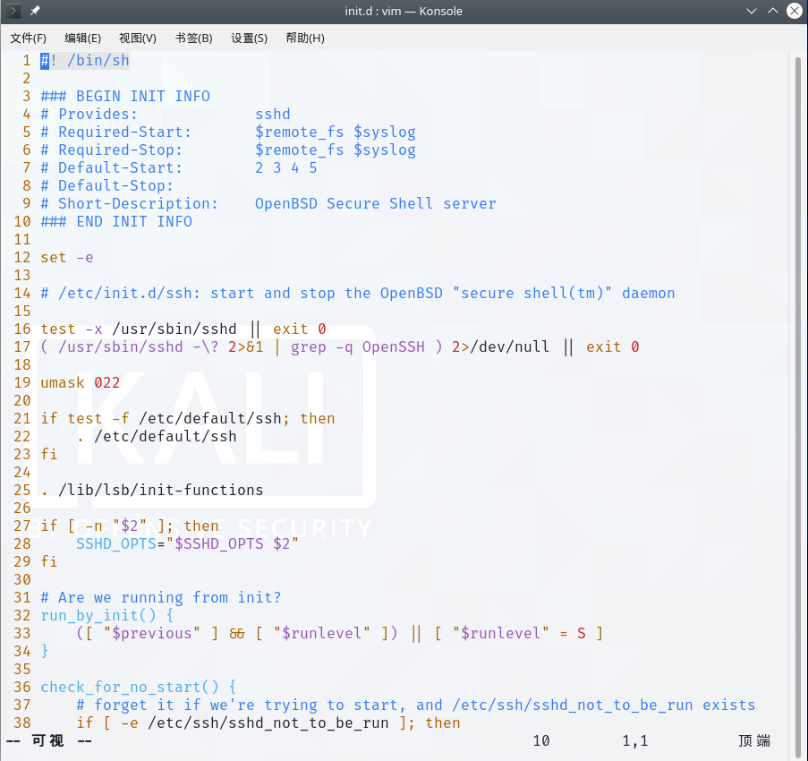

- [1. 前言](#1-前言)
  - [1.1. Usage](#11-usage)
    - [1.1.1. scp传文件](#111-scp传文件)
    - [1.1.2. ssh-keygen](#112-ssh-keygen)
    - [1.1.3. ssh客户端](#113-ssh客户端)
    - [1.1.4. sshd服务端](#114-sshd服务端)
- [2. 两种认证机制](#2-两种认证机制)
  - [2.1. 密码认证](#21-密码认证)
  - [2.2. 密钥认证](#22-密钥认证)
- [3. linux](#3-linux)
  - [3.1. 安装](#31-安装)
  - [3.2. Server定义允许谁进来](#32-server定义允许谁进来)
  - [3.3. Client便捷登录别人](#33-client便捷登录别人)
  - [3.4. Server Start](#34-server-start)
- [4. windows](#4-windows)
  - [4.1. 客户端](#41-客户端)
  - [4.2. 服务端](#42-服务端)
- [5. 登陆问题](#5-登陆问题)
  - [5.1. github](#51-github)
- [6. 其他ssh实例](#6-其他ssh实例)
---


# 1. 前言

与`telnet`、 `rlogin`、`FTP`明文传输不同，SSH可以对所有传输的数据进行加密，能够防止 DNS 欺骗和 IP 欺骗。


让ssh不安全的妙招:
- 使用密码登陆，可能会被冒充主机骗到，也可能被暴力破解，建议密钥
- 使用22端口，可能会被扫网，建议换成别的。
- 公私钥被窃取后，服务器就判断不出来了。
- Server的配置`PermitRootLogin`，禁止直接以root登陆的话`no`，那么就可以避免扫网，因为这样必须得知道你的普通用户名是什么(可能是coco，也可能是cola，而不是每台机子都有的root)。


## 1.1. Usage
### 1.1.1. scp传文件

```bash
usage: scp [-346BCpqrv] [-c cipher] [-F ssh_config] [-i identity_file]
           [-l limit] [-o ssh_option] [-P port] [-S program] source ... target

-l 网速限制
-P 端口
-r 递归文件
```

```bash
# file
$ scp usersomeone@192.168.135.83:~/wikiart.tar.gz .
# directory
$ scp -r usersomeone@192.168.135.83:~/Downloads .
```

### 1.1.2. ssh-keygen
生成密钥对，`id_rsa`是私钥，`id_rsa.pub`是公钥（其实都是文本文件）
```bash
$ ssh-keygen
Generating public/private rsa key pair.
Enter file in which to save the key (/home/sword/.ssh/id_rsa): 
【这里告诉你默认生成的位置，直接一路Enter】
Enter passphrase (empty for no passphrase): 
Enter same passphrase again: 
Your identification has been saved in /home/sword/.ssh/id_rsa
Your public key has been saved in /home/sword/.ssh/id_rsa.pub
The key fingerprint is:
SHA256:b1pwv7wBG1IOrznkNsAc1ZAfYwXwoCK50wlU9/b7/PQ sword@sword
The key's randomart image is:
+---[RSA 3072]----+
|  ... . ==.o.    |
| . . . +.o=      |
|  + . o +ooo     |
|   = = o *.      |
|  o o + S B      |
|   .   + B *     |
|        B * o .  |
|       . * + + . |
|        .   *o. E|
+----[SHA256]-----+
```


### 1.1.3. ssh客户端

```bash
usage: ssh [-46AaCfGgKkMNnqsTtVvXxYy] [-B bind_interface]
           [-b bind_address] [-c cipher_spec] [-D [bind_address:]port]
           [-E log_file] [-e escape_char] [-F configfile] [-I pkcs11]
           [-i identity_file] [-J [user@]host[:port]] [-L address]
           [-l login_name] [-m mac_spec] [-O ctl_cmd] [-o option] [-p port]
           [-Q query_option] [-R address] [-S ctl_path] [-W host:port]
           [-w local_tun[:remote_tun]] destination [command]
```
```bash
# 以端口2222登陆
ssh -p 2222 coco@192.168.112.130
```

`coco@192.168.112.130`就是`destination`（user@hostname）. 只有`192.168.112.130`的话，就是以当前客户端系统的用户名登陆。

`command`：一次性执行后退出远程登陆返回本机，而不是持久挂载shell。如`ssh coco@192.168.112.130 ls`。

### 1.1.4. sshd服务端
```bash
usage: sshd [-46DdeiqTt] [-C connection_spec] [-c host_cert_file]
            [-E log_file] [-f config_file] [-g login_grace_time]
            [-h host_key_file] [-o option] [-p port] [-u len]
```

```bash
$ sshd
sshd re-exec requires execution with an absolute path
【需要加上路径`/xxx/sshd xxx`。可以通过`which sshd`来寻找路径。】

$ which sshd          
/usr/sbin/sshd

$ /usr/sbin/sshd
sshd: no hostkeys available -- exiting.
【这是要我们的密钥对的私钥】
【默认文件是/etc/ssh/ssh_host_ecdsa_key, /etc/ssh/ssh_host_ed25519_key and /etc/ssh/ssh_host_rsa_key.】
【三者分别表示三种类型，选择其一即可。但是这些其实未被初始化，都是空的！！！】
【我们之前ssh-keygen，不是生成了/home/sword/.ssh/id_rsa，拿这搞】

$ /usr/sbin/sshd -h /home/sword/.ssh/id_rsa
【已经开启服务端了】
【或者直接修改默认配置文件/etc/ssh/sshd_config，`HostKey /home/sword/.ssh/id_rsa`】
```
```bash
# 关闭的话，杀死sshd进程就行
# 或者直接一步到位 pkill sshd
$ ps -e | grep ssh                         
    910 ?        00:00:00 ssh-agent
   1873 ?        00:00:00 sshd
                                                                                                                                                                                             
$ kill 1873   
```


> `/etc/init.d/ssh`



这个其实就是个脚本，将上面`sshd`的功能包装了一下，把一些命令按照用途分成了几个功能，省得你多写字。一般我们都是通过这个来启动sshd服务端，而不是敲复杂的`sshd xxx`命令。
```bash
Usage: /etc/init.d/ssh {start|stop|reload|force-reload|restart|try-restart|status}.
```

注意：这个脚本开启后是以`root`权限执行`/usr/sbin/sshd`的，所以注意`~`的问题，建议直接写成绝对路径。

PS：`/etc/init.d/`大多数是`ssh`，有的极个别的(IOS的ish)是`sshd`


# 2. 两种认证机制

一种是用户密码的方式，另一种是密钥验证的方式

## 2.1. 密码认证
过程：
1. 客户端向服务端发起登录请求，服务端将自己的公钥返回给客户端
2. 客户端输入登录口令，口令经客户端获得的公钥加密后发送到服务端
3. 服务端接收到加密口令后使用私钥解密，如果密码正确则登录成功

配置需求：
- 服务端要生成自己的私钥和公钥

```bash
# 以用户coco，登陆远程主机
ssh coco@192.168.112.130
```

```bash
The authenticity of host 'host (12.18.429.21)' can't be established.
RSA key fingerprint is 98:2e:d7:e0:de:9f:ac:67:28:c2:42:2d:37:16:58:4d.
Are you sure you want to continue connecting (yes/no)?
```

这是第一步服务端发来的公钥的公钥指纹（公钥的摘要），**让用户自行核对**。因为有一种攻击方式，骇客冒充服务器端，所以你需要手动核对这个公钥指纹是不是真的。

## 2.2. 密钥认证
过程：
1. 客户端发起密钥连接请求，并上传公钥。
2. 服务端收到公钥后，在可信列表文件`~/.ssh/authorized_keys`中查询此公钥，若无此客户端则断开连接，否则发送一串随机问询码（问询码用此客户端公钥加密处理）
3. 客户端收到加密问询码后，使用私钥解密出问询码再用通信session对问询码加密并传送给服务端
4. 服务端解密问询码并判定客户端身份安全与否，安全则建立连接

配置需求：
- 客户端生成自己的私钥和公钥
- 客户端将自己的公钥上传到服务端的可信列表文件中。

登陆步骤：前两步是第一次配置才需要


# 3. linux

## 3.1. 安装


Linux：默认有client, 但没有server

```bash
# client
sudo apt install openssh-client
# server
sudo apt install openssh-server
```

Configuration
- `/etc/ssh/sshd_config`：（扮演server时）sshd 配置文件。
- `~/.ssh/id_rsa`：`ssh-keygen`生成的私钥。
- `~/.ssh/id_rsa.pub`：`ssh-keygen`生成的公钥。
- `~/.ssh/authorized_keys`：（扮演server时）可信客户端列表。
- `~/.ssh/known_hosts`：（扮演client时）已知服务器列表。
- `~/.ssh/config`：（扮演client时）ssh 配置文件。

## 3.2. Server定义允许谁进来

> sshd 配置文件

```bash
# 这个是sshd读取的默认配置文件
sudo vim /etc/ssh/sshd_config
```

```bash
Port 22		# 端口
PermitRootLogin prohibit-password	# 允许直接以root登陆的策略
PasswordAuthentication yes
PubkeyAuthnentication yes
HostKey /home/sword/.ssh/id_rsa # 私钥
```

- 端口：建议换成7222之类的
- 直接root登陆：`prohibit-password`（默认，仅限公私钥），`yes`（都行），`forced-commands-only`(只能`ssh destination command`的形式登陆root)，`no`（禁止直接以root登陆，可以先登陆用户再sudo提升权限）
- 私钥：默认采用的是`/etc/ssh/ssh_host_ecdsa_key`, `/etc/ssh/ssh_host_ed25519_key`, `/etc/ssh/ssh_host_rsa_key`（碰到好几次系统初始化生成的这些都登不上，一定要自己用`ssh-keygen`生成`/home/sword/.ssh/id_rsa`下的。（`/etc/init.d/ssh`开启后是以`root`权限执行`/usr/sbin/sshd`的，所以注意`~`的问题，建议直接写成绝对路径。）

三种登陆选择：
- 只用密码：`PasswordAuthentication yes`，`PubkeyAuthnentication no`（`HostKey`就不用管了）。PS：`$ passwd`是你没设Linux当前用户的密码下才搞的，这密码不是ssh特定的。
- 只用密钥：`PasswordAuthentication no`是仅密钥，`PubkeyAuthnentication yes`，`HostKey`还要设定好。
- 先密钥再密码（默认）：`PasswordAuthentication yes`是密码和密钥都行，`PubkeyAuthnentication yes`，`HostKey`还要设定好。这样会先让你密钥登陆，不行的话再密码登陆。

配置完成后，要重新加载配置文件才生效：

```bash
# 重新加载配置文件
sudo /etc/init.d/ssh reload
```

> 密钥

- 如果到时候client用密码认证，那么只需要server生成公私钥。
```bash
ssh-keygen

# 调整私钥的文件权限
chmod 600 ~/.ssh/id_rsa
```

- 如果到时候client用密钥认证，那么server需要将client的公钥录入到server的`~/.ssh/authorized_keys`中。

```bash
# 客户端下：生成密钥对，放在~/.ssh下，id_rsa是私钥，id_rsa.pub是公钥（其实都是文本文件）
$ ssh-keygen

# 客户端上传公钥到服务器，被放到服务器的~/.ssh/authorized_keys中
# 或者 $ scp ~/.ssh/id_rsa.pub coco@192.168.112.130:~/.ssh/authorized_keys
# 或者在服务器上 $ cat ~/.ssh/id_rsa.pub >> ~/.ssh/authorized_keys
$ ssh-copy-id coco@192.168.112.130
```

PS: 
kali下普通用户的`~`是`/home/user`，root的`~`是`/root`。当你是在普通用户时，在`/home/user/.ssh`中，是root时在`/root/.ssh`中。
客户端生成密钥对是客户端系统登陆的`~`；公钥被上传到服务器也是服务器系统登陆的`~`；服务器查客户端公钥也是`~/.ssh/authorized_keys`是根据服务器要登陆的`~`，比如`ssh co@192.168.1.100`是`/home/co/.ssh/authorized_keys`，`ssh root@192.168.1.100`是`/root/.ssh/authorized_keys`。
## 3.3. Client便捷登录别人

这个用于将经常登录的帐号记录下来, 像快捷方式一样便捷使用.

```bash
vim ~/.ssh/config
# 或者直接修改根配置文件 vim /etc/ssh/ssh_config
# 优先级是`~/.ssh/config`高，然后是`/etc/ssh/ssh_config`。
```


```bash
Host co
    User coco
    HostName 192.168.112.130
    Port 7222	# 登陆端口，默认22就不用写
    IdentityFile ~/.ssh/id_rsa # 私钥，选了这个就不能密码登陆
```

```bash
$ ssh co
```
注意：这里找co是在config中找，当你（是客户端系统登陆的，而不是config中的User）是在普通用户时，在`/home/user/.ssh/config`找；当你是root时在`/root/.ssh/config`找。或者你可以指定位置， `ssh -F File destination`。
这么就会出现一个问题，如果config创建在`/home/user/.ssh/config`时，而你用`sudo ssh co`，那么就会去`/root/.ssh/config`找，还非得你退出root权限。修改`/etc/ssh/ssh_config`的好处是，避免出现这种情况。

## 3.4. Server Start

> 脚本启动
```bash
# 两种等价
# 启动1：这是脚本，让脚本再去启动sshd程序
sudo /etc/init.d/ssh start

# 启动2：这是脚本的service写法。命令还是一样
sudo service ssh start
```

```bash
# 查看是否启动
sudo /etc/init.d/ssh status

# 或者
ps -e | grep ssh
```

```bash
# 关闭
sudo /etc/init.d/ssh stop
# 或者
sudo service ssh stop
```

> 原生启动

```bash
# 直接启动sshd程序
/usr/sbin/sshd

# 需要手动关闭才行
$ ps -e | grep ssh
    987 ?        00:00:00 ssh-agent
   1505 ?        00:00:00 sshd

$ kill 987 1505
```

- 直接启动sshd程序后，`sudo service status`看不到启动，只能用`ps -e | grep ssh`确认是否启动。
- 直接启动sshd程序后，`sudo service stop`关不掉，只能`kill`
- 直接启动sshd程序后，如果没有kill，那么`sudo service ssh start`就会因为矛盾而启动失败。


# 4. windows

## 4.1. 客户端
OpenSSH 已添加至Windows 10：`C:\Windows\System32\OpenSSH`。
  

> 创建config

```bash
cd %userprofile%
mkdir .ssh
cd .ssh
cat > config
notepad config
```

`cd %userprofile%`就是用户目录下, 我们创建`%userprofile%\.ssh\config`文件.

`cat > config`创建空后缀的空文件, 直接`notepad config`的后缀是`.txt`.

> 其他

`ssh-keygen`生成的密钥、本机充当客户端的登陆文件`config`、`known_hosts`都在windows在`C:\Users\xxx\.ssh`下


## 4.2. 服务端
> 安装

默认没装, 去windows设置的【应用】【可选功能】【添加功能】【OpenSSH 服务器】
  

会多出服务器的程序


`sshd_config_default`是本机充当服务端的配置文件。

> 启动服务器
```bash
# 需要以管理员身份打开cmd
net start sshd
net stop sshd

# 也可以原生sshd程序启动。
```
> 自启动

windows shell:startup xxx.bat
```bash
%1 mshta vbscript:CreateObject("Shell.Application").ShellExecute("cmd.exe","/c %~s0 ::","","runas",1)(window.close)&&exit

net stop sshd
net start sshd
```


# 5. 登陆问题
> WARNING: UNPROTECTED PRIVATE KEY FILE!

在上面说了

> WARNING: REMOTE HOST IDENTIFICATION HAS CHANGED!

这里要登陆的服务器变化了，因为你客户端本地存有以前记住的服务器，所以发现不匹配后的问题。解决办法就是删除**客户端**中的`~/.ssh/known_hosts`的对应的服务器ip的记录。

> WARNING: UNPROTECTED PRIVATE KEY FILE!
```bash
$ /usr/sbin/sshd -h /home/sword/.ssh/id_rsa
@@@@@@@@@@@@@@@@@@@@@@@@@@@@@@@@@@@@@@@@@@@@@@@@@@@@@@@@@@@
@         WARNING: UNPROTECTED PRIVATE KEY FILE!          @
@@@@@@@@@@@@@@@@@@@@@@@@@@@@@@@@@@@@@@@@@@@@@@@@@@@@@@@@@@@
Permissions 0644 for '/home/sword/.ssh/known_hosts' are too open.
It is required that your private key files are NOT accessible by others.
This private key will be ignored.
Unable to load host key "/home/sword/.ssh/known_hosts": bad permissions
Unable to load host key: /home/sword/.ssh/known_hosts
sshd: no hostkeys available -- exiting.
【这个情况是说/home/sword/.ssh/id_rsa的文件权限太开放，容易被骇客入侵，我们修改权限就行】

$ chmod 0600 /home/sword/.ssh/id_rsa
```
## 5.1. github

都是一个问题：
> 问题一：ssh: connect to host github.com port 22: Connection refused

> 问题二：fatal: unable to access 'https://github.com/telesoho/vscode-markdown-paste-image.git/': SSL certificate problem: unable to get local issuer certificate

> 问题三：Cloning into 'development_configurations'...
git@ssh.github.com: Permission denied (publickey).
fatal: Could not read from remote repository.
Please make sure you have the correct access rights
and the repository exists.

> 问题四：git@ssh.github.com: Permission denied (publickey).


第一，https失灵，要用git
原因是不能用`git clone https://github.com/telesoho/vscode-markdown-paste-image.git`的https协议，而是用git协议，`git clone git@github.com:telesoho/vscode-markdown-paste-image.git`

所以，之后都是配置git。

第二，上传公钥
```bash
$ sudo ssh-keygen

$ sudo cat /root/.ssh/id_rsa.pub
ssh-rsa 
...
```
需要你上传公钥`id_rsa.pub`到github上后，就好了。

第三，域名污染

经过`ssh -vT git@github.com`（T用来测试，v用来显示详情）测试后，发现是国内找不到github.com的ip，所以我们用ssh.github.com来定位github的ip。
```bash
$ sudo vim /root/.ssh/config
```
```bash
Host github.com
HostName ssh.github.com	# 关键就是，不是用github.com，而是用ssh.github.com
PreferredAuthentications publickey
IdentityFile /root/.ssh/id_rsa
```

PS：配置git公钥前，不用配置用户名、邮箱，只要上传了公钥就行了，那只是为了定制公钥，没必要。

PS2：少了第三步，就会出现问题四，让你输密码，然而输入了还是不对的现象。另外，你去github下看你的密钥使用情况，显示从未使用，因此就说明这是域名污染，而导致压根没没用密钥的情况。


# 6. 其他ssh实例
【win10客户端 ssh 自己的虚拟机linux服务器】

虚拟机网络使用桥接模式，虚拟机充当服务器`sudo /etc/init.d/ssh start`，查看虚拟机的ip`ifconfig`看到`192.168.1.107`，win10直接cmd下`ssh coco@192.168.1.107`。

同理，手机下个JuiceSSH也能连。

【ipad ssh自己】
越狱，安装openssh，这时其他设备已经可以`ssh root@192.168.1.100`（ipad的ip）。

但因为IOS系统不能直接连接自己的22端口，所以另建端口。
`vim /etc/services`

```bash
ssh              22/udp     # SSH Remote Login Protocol
ssh              22/tcp     # SSH Remote Login Protocol
ssh2             7222/udp
ssh2             7222/tcp
```
`vim /Library/LaunchDaemons/com.openssh.sshd.plist`

```xml
<key>Sockets</key>
<dict>
	<key>SSHListener</key>
		<dict>
			<key>SockServiceName</key>
			<string>ssh</string>
		</dict>
	<key>SSHListener2</key>
		<dict>
			<key>SockServiceName</key>
			<string>ssh2</string>
		</dict>
</dict>          
```
`reboot`后，就可以`ssh -p 7222 root@localhost`(ipad连自己)。
