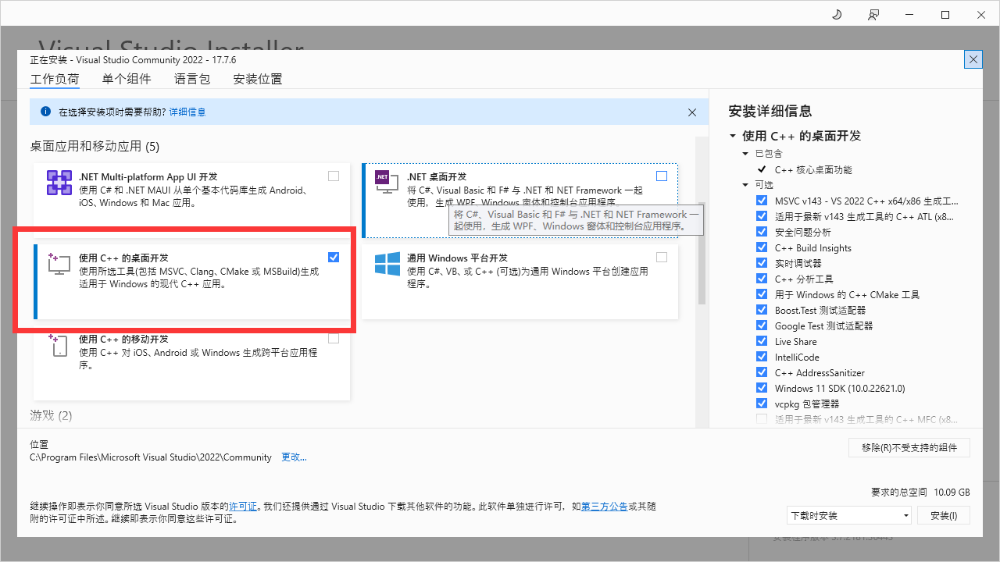
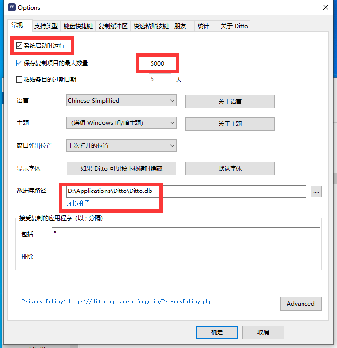

- [1. 预先保存](#1-预先保存)
- [2. 软件](#2-软件)
  - [2.1. 不想转移系统的](#21-不想转移系统的)
  - [2.2. 不能转移系统的](#22-不能转移系统的)
  - [2.3. 可以转移系统的](#23-可以转移系统的)
- [typora](#typora)

---

C盘系统盘，装不可转移的东西
- 默认软件安装，不想转移系统的，不能转移系统的：`C:/Program Files (x86)`

D盘，存可以转移系统的东西。
- 可以转移系统的：`D:/Applications`
- 浏览器下载在: `D:\Downloads`
---

## 1. 预先保存

`.ssh`

`.gitconfig`

`.condarc`

## 2. 软件

### 2.1. 不想转移系统的

- 电脑管家
- WPS
- office365
- steam
- EpicGame
- 向日葵
- PotPlayer(可以打开，但是没有默认应用设置，太不方便了)

### 2.2. 不能转移系统的
- edge: 设置浏览器的默认下载位置为`D:\Downloads`
- 手心输入法
- windows terminal
- 驱动更新, 系统cuda。
- PS
- PR
- 安装字体：[./shell美化/oh-my-posh/Noto Mono Nerd Font Complete.ttf](./shell美化/oh-my-posh/Noto%20Mono%20Nerd%20Font%20Complete.ttf)
- visual studio

  

- Tim（只是迁移数据，然后软件重启，还是默认的c盘存储，垃圾！）

    
    
    
- 7z
- 屏幕亮度调节：monitorian 软件商店里的

### 2.3. 可以转移系统的

- 微信

  

- 百度云
- clash
- Ditto

    
- Everything
- FolderSizeExplorer
- 格式工厂
- PotPlayer
- RightMenuMgr
- tabby
- simpletex
- zotero
- IDM

> 其他配置的

- powershell权限修改: [./shell美化/oh-my-posh/readme.md](./shell美化/oh-my-posh/readme.md)
- git: 环境变量`D:\Applications\Git\bin`；`.gitconfig`文件
- miniconda: `.condarc`；`conda init`
- cmake: 环境变量 `D:\Applications\cmake\bin`
- msys2: 环境变量 `D:\Applications\msys2\ucrt64\bin`
- scrcpy: 环境变量 ``

## typora

下载最新正版

`D:\MySoftware\Typora\resources\page-dist\static\js\LicenseIndex.180dd4c7.c77b6991.chunk.js`

`e.hasActivated="true"==e.hasActivated`

替换为

`e.hasActivated="true"=="true"`

[搭建图床picgo + github + typora](https://blog.csdn.net/xdnxl/article/details/129466060)