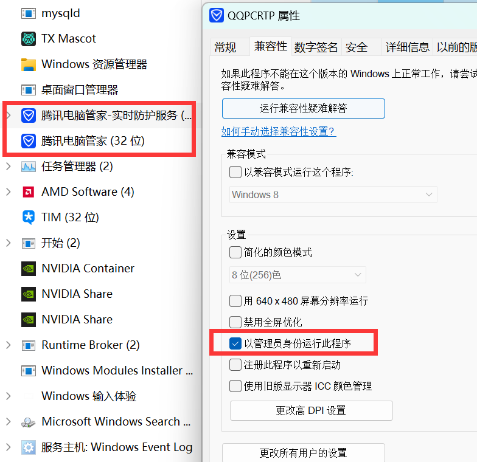
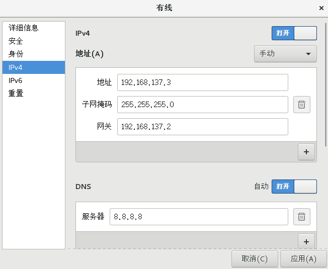

## vmware tools

```bash
./vmware-install.pl -f -d
-f : 强制安装
-d : 自动回答问题与建议的答案。
```

## nat

1. 虚拟机通过虚拟机网络适配器wmnet8 来联网，它的ip是`xxx.xxx.xxx.1`。所以虚拟机ip、虚拟机网关都要不是这个。
2. subip和mask是虚拟机ip的可选范围，虚拟机网关也在这个范围里，默认是`xxx.xxx.xxx.2`
3. 登录虚拟机，设置ip为固定ip`xxx.xxx.xxx.3`，重启虚拟机网络。
4. 可以ping通www.baidu.com, 虚拟机网关2, 主机ip。不能vmnet8的1


```
以太网适配器 VMware Network Adapter VMnet8:

连接特定的 DNS 后缀 . . . . . . . :
本地链接 IPv6 地址. . . . . . . . : fe80::bc2:e3cd:62f8:f82d%5
IPv4 地址 . . . . . . . . . . . . : 192.168.137.1
子网掩码  . . . . . . . . . . . . : 255.255.255.0
默认网关. . . . . . . . . . . . . :
```





```
# 应用完后，重启后才变化
$ service network restart
$ ifconfig 
..... xxx.xxx.xxx.3
```

```
# 可以非图形化设置网关
# sudo vim /etc/sysconfig/network-scripts/ifcfg-ens33 
TYPE=Ethernet
PROXY_METHOD=none
BROWSER_ONLY=no
BOOTPROTO=none      # none，用固定
DEFROUTE=yes
IPV4_FAILURE_FATAL=no
IPV6INIT=yes
IPV6_AUTOCONF=yes
IPV6_DEFROUTE=yes
IPV6_FAILURE_FATAL=no
IPV6_ADDR_GEN_MODE=stable-privacy
NAME=ens33
UUID=28711c7c-1216-454e-a454-b7c9a08e71e6
DEVICE=ens33
ONBOOT=yes          # yes,开机启动
IPV6_PRIVACY=no
IPADDR=192.168.137.3    # ip
PREFIX=24
GATEWAY=192.168.137.2   # 网关
DNS1=8.8.8.8
```

```bash
# 网关
[root@localhost miaoruntu]# ping 192.168.137.2
PING 192.168.137.2 (192.168.137.2) 56(84) bytes of data.
64 bytes from 192.168.137.2: icmp_seq=1 ttl=128 time=0.189 ms
64 bytes from 192.168.137.2: icmp_seq=2 ttl=128 time=0.148 ms
^C
--- 192.168.137.2 ping statistics ---
2 packets transmitted, 2 received, 0% packet loss, time 1000ms
rtt min/avg/max/mdev = 0.148/0.168/0.189/0.024 ms
# 主机
[root@localhost miaoruntu]# ping 192.168.190.52
PING 192.168.190.52 (192.168.190.52) 56(84) bytes of data.
64 bytes from 192.168.190.52: icmp_seq=1 ttl=128 time=0.417 ms
^C
--- 192.168.190.52 ping statistics ---
1 packets transmitted, 1 received, 0% packet loss, time 0ms
rtt min/avg/max/mdev = 0.417/0.417/0.417/0.000 ms
# 上网
[root@localhost miaoruntu]# ping www.baidu.com
PING www.a.shifen.com (183.2.172.185) 56(84) bytes of data.
64 bytes from 183.2.172.185 (183.2.172.185): icmp_seq=1 ttl=128 time=49.6 ms

```