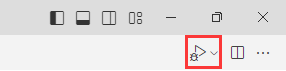

- [1. How to debug](#1-how-to-debug)
- [2. launch](#2-launch)
  - [2.1. basic configurations](#21-basic-configurations)
    - [2.1.1. `name`](#211-name)
    - [2.1.2. `type`](#212-type)
    - [2.1.3. `request`](#213-request)
    - [2.1.4. `program`](#214-program)
    - [2.1.5. args](#215-args)
    - [2.1.6. cwd](#216-cwd)
  - [2.2. Advanced Use](#22-advanced-use)
- [3. Task](#3-task)
  - [3.1. note Example of ts:](#31-note-example-of-ts)
  - [3.2. cpp](#32-cpp)
  - [3.3. cpp2](#33-cpp2)
- [4. select python interpreter](#4-select-python-interpreter)

---

## 1. How to debug

`launch.json` file in the directory `.vscode`.

```json
{
    "version": "0.2.0",
    "configurations": [
        {
            "name": "Python: Current File",
            "type": "python",
            "request": "launch",
            "program": "${file}",
            "args":[
                "--port", "8080",
                "--online"
            ]
        },
        {
            // 多个 debug 配置
        }
    ]
}
```

Through the Run and Debug view.

  

而不是右上角的debug按钮，这只会执行无配置的debug。



## 2. launch
### 2.1. basic configurations
#### 2.1.1. `name`
  
debug 配置名称，将会在启动配置的下拉菜单中显示

You can name anything you want.

  


#### 2.1.2. `type`
  
Identifies the type of debugger to use. 

- 编译语言
    
    `node`,
    
    `python`,
    
    `cppdpg`/`cppvsdbg`(`cppvsdbg` when using the Visual Studio Windows debugger, and `cppdbg` when using GDB or LLDB);
- 开发插件 `extensionHost`

#### 2.1.3. `request`
  
Specifies the mode in which to start debugging. 

`launch`: start the debugger on the file specified in program.

`attach`: attach the debugger to an already running process. 

- `port`
  
  port when attaching to a running process


#### 2.1.4. `program`
  
要编译运行的源代码文件。

假设`student.py`文件的路径是`E:\CodeProject\Git\vscode-path\src\student.py`。
- `${workspaceFolder}`或者`${workspaceRoot}`: 
  工作区`.vscode`的父目录的绝对路径, 如`E:\CodeProject\Git\vscode-path`
- `${fileDirname}`: 
  当前文件的父目录的绝对路径。`E:\CodeProject\Git\vscode-path\src` 
- `${file}`: 
  当前文件的绝对路径。`E:\CodeProject\Git\vscode-path\src\student.py`
- `${relativeFile}`: 
  当前文件对于工作区间父目录的相对路径。`src\student.py`
- `${fileBasename}`:
  只是文件的名字，带后缀。`student.py`
- `${fileBasenameNoExtension}`: 
  不带后缀。`student`

PS：“当前文件”是指editor打开的文件，本来想要运行`student.py`，editor却打开了`teacher.py`，则运行的是`teacher.py`。


#### 2.1.5. args

Specifies arguments to pass to the Python program. 

Each element of the argument string that's separated by a space should be contained within **double quotes** `"`(single quote `'` is wrong.)

If no need args, don't writie `args` configuration.

e.g. `python main.py --port 8080 --online` corresponds to  `["--port", "8080", "--online"]`.

> trick
```python
>>> '--port 8080 --online'.split()
['--port', '8080', '--online']
```
再用vscode的查找替换单引号为双引号。

#### 2.1.6. cwd
  
Specifies the current working directory for the debugger, which is the base folder for any relative paths used in code. If omitted, defaults to `${workspaceFolder}`
  
 

```
├── py_code
│   ├── app.py
├── data
│   ├── salaries.csv
```
  
### 2.2. Advanced Use


- `environment`
  
  Environment variables to add to the environment for the program.
  
  The values for these variables must be entered as strings and the value null can be used to "undefine" a variable.
  
  Example: `"environment": [ { "name": "config", "value": "Debug" } ]`, not `"environment": [ { "config": "Debug" } ]`.


- `console`
  
  what kind of console to use, for example, `internalConsole`, `integratedTerminal`(default), or `externalTerminal`

- `externalConsole`
  
  Default value is false.

  Used only when launching the debuggee. For attach, this parameter does not change the debuggee's behavior.

  - Windows: When set to true, it will spawn an external console. When set to false, it will use VS Code's integratedTerminal.
  - Linux: When set to true, it will notify VS Code to spawn an external console. When set to false, it will use VS Code's integratedTerminal.
  - macOS: When set to true, it will spawn an external console through lldb-mi. When set to false, the output can be seen in VS Code's debugConsole. Due to limitations within lldb-mi, integratedTerminal support is not available.


- `stopAtEntry`
  
  Default value is false.
  
  If set to true, the debugger should stop at the entry-point of the target (ignored on attach). 

- `justMyCode`

  Default value is true.

  If set to true, restricts debugging to user-written code only. Set to false to also enable debugging of standard library functions.


- `"windows"` for Windows, `"linux"` for Linux, and `"osx"` for macOS. 
  
  Properties defined in an operating system specific scope override properties defined in the global scope.
  
PS: Deprecated : `targetArchitecture`


## 3. Task

设定一个task配合debug，可以是debug前做什么事、也可以是debug后做什么事。

- `preLaunchTask`
  
  to launch a task before the start of a debug session.
  
  `label`: 这种方式一般用于使用现成的外部编辑器编辑好程序再和vscode的debugger连接起来，比如g++, make, npm的eslint。
  
  `program` 要编译的文件是 preLaunchTask 生成的，而不是原来的。
  
- `postDebugTask`
  
  to launch a task at the very end of a debug session, set this attribute to the name of a task specified in tasks.json (in the workspace's `.vscode` folder).


### 3.1. note Example of ts:

launch.json:
```json
{
    "version": "0.2.0",
    "configurations": [
        {
            "type": "node",
            "request": "launch",
            "name": "Launch ts",
            "program": "${workspaceFolder}/test.js",
            "preLaunchTask":"tsc: 构建 - tsconfig.json",
            "console": "integratedTerminal",
            "skipFiles": [
                "<node_internals>/**"
            ],
        }
    ]
}
```
tasks.json:
```json
{
    "version": "2.0.0",
    "tasks": [
        {
            "type": "typescript",
            "label": "tsc: 构建 - tsconfig.json",
            "tsconfig": "tsconfig.json",
            "problemMatcher": [
                "$tsc"
            ],
            "group": "build"
        }
    ]
}
```

The task's properties have the following semantic:

> basic

- `label`: The task's label used in the user interface. tasks在Ctrl+Shift+B中显示的名称

- `type`: The task's type. 
  
    For a custom task, this can either be `shell` or process. 
    
    If shell is specified, the command is interpreted as a shell command (for example: `bash`, `cmd`, or `PowerShell`). 
    
    If process is specified, the command is interpreted as a process to execute(for example: `typerscript`).

- `group`: 
  
  Defines to which group the task belongs, `test` or `build`. 
  
  Tasks that belong to the test group can be executed by running Run Test Task from the Command Palette.

- `presentation`: Defines how the task output is handled in the user interface, `always`, `never`.


> advanced

- `command`: The actual command to execute.

- `runOptions`: Defines when and how a task is run.

- `windows`: Any Windows specific properties. Will be used instead of the default properties when the command is executed on the Windows operating system.

- `options`: Override the defaults for `cwd` (current working directory), `env` (environment variables), or `shell` (default shell). 
  
    Options can be set per task but also globally or per platform. 
    
    Environment variables configured here can only be referenced from within your task script or process and will not be resolved if they are part of your args, command, or other task attributes.

### 3.2. cpp


Visual Studio Code supports the following **debuggers** for C/C++ depending on the operating system you are using:
- Linux: GDB
- macOS: LLDB or GDB
- Windows: the Visual Studio Windows Debugger or GDB (using Cygwin or MinGW)

- `launch.json`
```json
{
    "version": "0.2.0",
    "configurations": [
        {
            "name": "C++ Launch",
            "type": "cppdbg", // 配置类型，这里只能为cppdbg
            "request": "launch",
            "cwd": "${workspaceRoot}", // 调试程序时的工作目录，一般为${workspaceRoot}即代码所在目录
            "args": [], // 程序调试时传递给程序的命令行参数，一般设为空即可
            "program": "${fileDirname}/${fileBasenameNoExtension}.exe",
            "preLaunchTask": "g++",
            "linux": {
              "MIMode": "gdb",
              "miDebuggerPath": "/usr/bin/gdb"
            },
            "osx": {
              "MIMode": "lldb"
            },
            "windows": {
              "MIMode": "gdb",  // VSCode要使用的调试工具。 Indicates the debugger that VS Code will connect to. Must be set to gdb or lldb. This is pre-configured on a per-operating system basis and can be changed as needed.
              "miDebuggerPath": "C:\\MinGw\\bin\\gdb.exe"  // miDebugger的路径，注意这里要与MinGw的路径对应
            },
            // 整齐打印
            "setupCommands": [
                {
                    "description": "Enable pretty-printing for gdb",
                    "text": "-enable-pretty-printing",
                    "ignoreFailures": true
                }
            ],
        }
    ]
}
```

- `tasks.json`

```json
{
    "version": "2.0.0",
    "command": "g++",
    "args": [
        "-g",
        "${file}",
        "-o",
        "${fileDirname}/${fileBasenameNoExtension}.exe"//一定要写上"{fileDirname}/"，不然可以运行但是调试不了
    ], // 编译命令参数
    "problemMatcher": {
        "owner": "cpp",
        "fileLocation": [
            "relative",
            "${workspaceRoot}"
        ],
        "pattern": {
            "regexp": "^(.*):(\\d+):(\\d+):\\s+(warning|error):\\s+(.*)$",
            "file": 1,
            "line": 2,
            "column": 3,
            "severity": 4,
            "message": 5
        }
    },
    "group":{
        "kind": "build",
        "isDefault": true
    }
}
```
- `c_cpp_properties.json`
```json
{
    "configurations": [
        {
            "name": "Win32",
            "includePath": [
                "${workspaceFolder}/**"
            ],
            "defines": [
                "_DEBUG",
                "UNICODE",
                "_UNICODE"
            ],
            "compilerPath": "E:/MyHacker/mingw64/bin/g++.exe", // 这里要改！改成你安装mingw的目录下的/bin/g++.exe
            "cStandard": "c11", // c用c11
            "cppStandard": "c++17", // c++用17
            "intelliSenseMode": "gcc-x64"
        }
    ],
    "version": 4
}
```
- `settings.json`
```json
{
    // 解决终端中文乱码
    "terminal.integrated.shellArgs.windows": ["-NoExit", "/c", "chcp 65001"],
    "terminal.integrated.fontFamily": "Lucida Console",
    // c++ 配置
    "files.associations": {
        "array": "cpp",
        "*.tcc": "cpp",
        "istream": "cpp",
        "streambuf": "cpp",
        "string_view": "cpp",
        "iostream": "cpp",
        "atomic": "cpp",
        "cctype": "cpp",
        "clocale": "cpp",
        "cmath": "cpp",
        "cstdarg": "cpp",
        "cstddef": "cpp",
        "cstdint": "cpp",
        "cstdio": "cpp",
        "cstdlib": "cpp",
        "cwchar": "cpp",
        "cwctype": "cpp",
        "deque": "cpp",
        "unordered_map": "cpp",
        "vector": "cpp",
        "exception": "cpp",
        "algorithm": "cpp",
        "map": "cpp",
        "memory": "cpp",
        "memory_resource": "cpp",
        "optional": "cpp",
        "string": "cpp",
        "system_error": "cpp",
        "tuple": "cpp",
        "type_traits": "cpp",
        "utility": "cpp",
        "fstream": "cpp",
        "initializer_list": "cpp",
        "iosfwd": "cpp",
        "limits": "cpp",
        "new": "cpp",
        "ostream": "cpp",
        "sstream": "cpp",
        "stdexcept": "cpp",
        "typeinfo": "cpp",
        "list": "cpp",
        "unordered_set": "cpp"
    },
    "C_Cpp.errorSquiggles": "Enabled",
}
```
### 3.3. cpp2

只要一个 `tasks.json`

```json
{
    "tasks": [
        {
            "type": "cppbuild",
            "label": "C/C++: g++.exe build active file",
            "command": "D:\\msys2\\ucrt64\\bin\\g++.exe",
            "args": [
                "-fdiagnostics-color=always",
                "-g",
                "${file}",
                "-o",
                "${fileDirname}/${fileBasenameNoExtension}.exe"
            ],
            "options": {
                "cwd": "${fileDirname}"
            },
            "problemMatcher": [
                "$gcc"
            ],
            "group": {
                "kind": "build",
                "isDefault": true
            },
            "detail": "Task generated by Debugger."
        }
    ],
    "version": "2.0.0"
}
```

## 4. select python interpreter

第一，debug是在集成终端里执行python的。也就是说，以下三个方法，其实都是vscode在终端里帮我们打了`conda activate ENVIRON`(conda) or `source venv/bin/activate`(virtualenv)来激活虚拟环境。
- 状态栏里选择python interpreter
- settings.json里的python.defaultInterpreterPath
```json
"python.defaultInterpreterPath": "/home/sword/anaconda3/envs/high/bin/python"
```
- ctr+shift+p的command，`Python: Select Interpreter`
  

第二，每次debug只要不关原来那个终端，那就还是在那个终端里再次执行debug，也就算上次的虚拟环境会被继承。

第三，vscode帮我们激活虚拟环境也有限制，debug的终端只会在初始化时激活不同的python interpreter。也就是说，如果上次的debug终端没有关，而我们想要换另一个虚拟环境，使用上述的三种方式，我们都会发现没有任何效果。所以，解决方法就是在debug的终端里，手动激活环境变量`conda activate ENVIRON`(conda) or `source venv/bin/activate`(virtualenv)，或者，我们把老的终端终止掉（不是ctrl+j这样的隐藏终端，而是这样中止），这样debug就会再次新的初始化。
  


PS: `python.terminal.activateEnvironment`选中。这样debug打开端口的第一步就是去激活虚拟环境。
