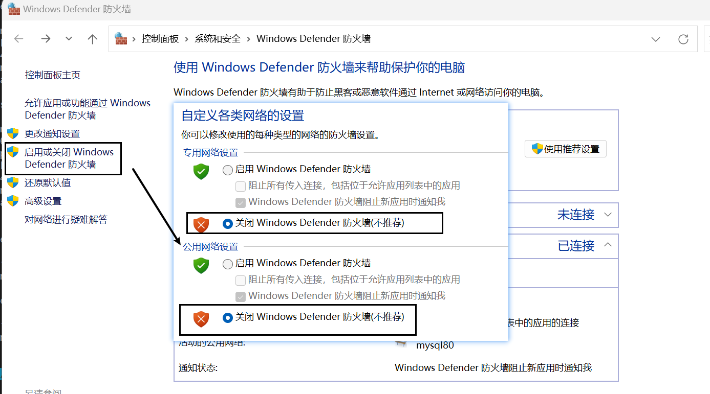

## 取消防火墙

## 没试过：允许应用通过防火墙
以win10为例，进入控制面板-系统和安全-Windows Defender 防火墙-高级设置，进入高级安全设置，如下图所示。然后点击3处，设置防火墙属性，如果发现出现的页面和下图右侧不同，可以点击2处回到此显示页面。

虚拟机与真实主机属于局域网，因此首先需要在"专用配置文件"页将"入站连接"选择为"允许"，表示允许局域网其他主机绕过防火墙访问本机。点击确定。

但此时可能仍然无法ping通，我们再点击入站规则，在右侧找到"文件和打印共享（回显请求 – ICMPv4-In)"项，"回显请求"，指的就是ping请求的回显响应吧。如下图，设置之前，1处应该是"否"，2处应该是"启用规则"，点击"启用规则"，就会变成下图的样子了，注意文件和打印共享之回显请求一共有4项，IPV4和IPV6各两项，每个下面包括"域"和“专用，公用”，我们要选择IPV4和"专用，公用"的那项，不要弄错。

完成上述操作之后，就会惊喜地发现，可以用虚拟机ping通真实主机地址啦，而且不用关闭windows防火墙！