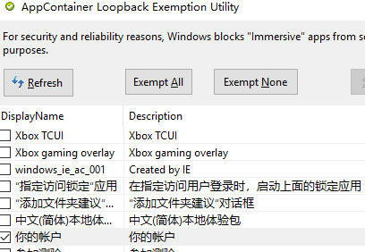

win11微软账户一直登不上去，提示“发生了错误”:
- 不开梯子，连不上外网
- 开了梯子，报错。

## 已成功

[win10系统,通过window商店下载的app不能代理,试过网易云音乐,哔哩哔哩,日志也没有相关信息 #13](https://github.com/Fndroid/clash_for_windows_pkg/issues/13): UWP应用由于阻止了loopback，所以无法使用本地代理

解决方法：Fiddler4。[腾讯电脑管家](https://pc.qq.com/detail/10/detail_3330.html)；[百度云](链接：https://pan.baidu.com/s/1Z-dWE3gBQ0lbVCuBiLQIwg?pwd=s0lm)
- 打开Fiddler4
- 点左上角的 `winconfig`
- 勾选“你的账户”

    

## 未尝试

<https://zhuanlan.zhihu.com/p/603823349>