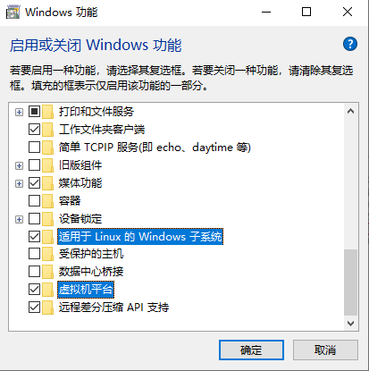
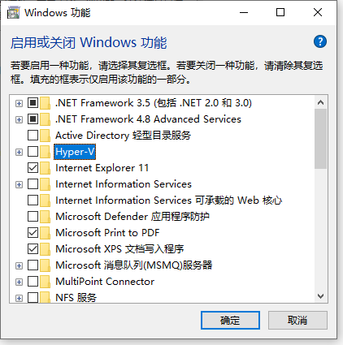

- [1. WSL2, Docker](#1-wsl2-docker)
- [2. VMware](#2-vmware)
- [3. How to both have VMware, WSL and Docker?](#3-how-to-both-have-vmware-wsl-and-docker)

---
# 1. WSL2, Docker

docker需要wsl，而wsl需要安一个OS，所以其实docker就是在wsl的OS系统上的。

1. Windows Feature

    运行 `C:\Windows\System32\OptionalFeatures.exe`. 
    
      
    
    
    勾选 `Windows Subsystem for Linux（适用于Linux的Windows子系统）` 和 `Virtual Machine Platform（虚拟机平台）`
     
    
    
2. Virtualization enabled in the BIOS

    
    
3. Hypervisor enabled at Windows startup
   
   - Open **cmd** (console prompt) window as an administrator. PS: not powershell.
   - Run "`bcdedit /enum {current}`" to watch the value of `hypervisorlaunchtype`. We need enable it.
   - Run "`bcdedit /set hypervisorlaunchtype auto`" to enable hypervisor.
   - Close the cmd and restart the system.

# 2. VMware

> VMware Workstation and Device/Credential Guard are not compatible. VMware Workstation can be run after disabling Device/Credential Guard.

1. Windows Feature

    Turn Off `Hyper-V`.

      

2. Virtualization enabled in the BIOS

    

3. Hypervisor disabled at Windows startup
   
   - Open **cmd** (console prompt) window as an administrator. PS: not powershell.
   - Run "`bcdedit /enum {current}`" to watch the value of `hypervisorlaunchtype`. We need enable it.
   - Run "`bcdedit /set hypervisorlaunchtype off`" to enable hypervisor.
   - Close the cmd and restart the system.

We should be able to power on the Virtual Machine in Workstation now. However, WSL2 and Docker can not work.

# 3. How to both have VMware, WSL and Docker?

The answer is Virtual Box instead VMware. Virtual Box always works whether Hypervisor enabled or disabled.

However, I find the linux works well in both virtual machiner software while the win10 slowly runs in virtual box and runs well in vmware.