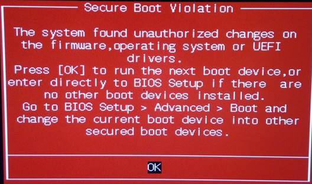
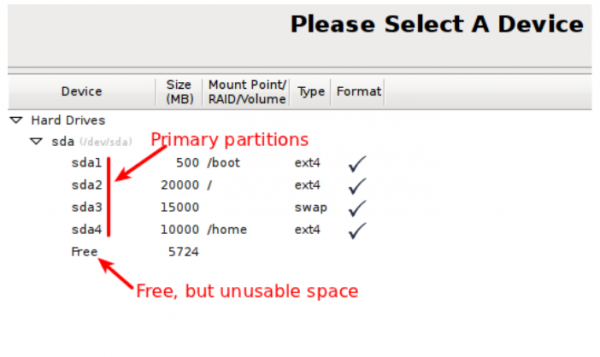
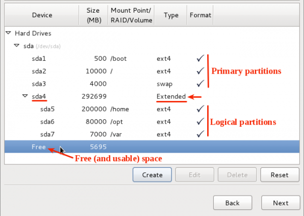

- [1. boot](#1-boot)
  - [1.1. secure boot](#11-secure-boot)
  - [1.2. 分区](#12-分区)
  - [1.3. UEFI,MBR,GPT,EFI:](#13-uefimbrgptefi)
    - [1.3.1. 细节](#131-细节)
    - [1.3.2. 分区例子](#132-分区例子)
  - [1.4. double boot](#14-double-boot)
    - [1.4.1. Make boot USB](#141-make-boot-usb)
    - [1.4.2. Always install Windows first](#142-always-install-windows-first)
    - [1.4.3. vanishing linux boot](#143-vanishing-linux-boot)
    - [1.4.4. boot sequence](#144-boot-sequence)
  - [1.5. 扩容](#15-扩容)
  - [1.6. windows时间不一致](#16-windows时间不一致)
---

# 1. boot
## 1.1. secure boot
没关长这样。
  


## 1.2. 分区
## 1.3. UEFI,MBR,GPT,EFI:
- 主板的引导启动方式。古老的是Legacy BIOS，现代的是UEFI
- 硬盘分区表的布局。古老的是MBR（Master Boot Record），现代是GPT（Globally Unique Identifier (GUID) Partition Table）。EFI是GPT中的系统启动分区。
- 如果用UEFI模式启动，就使用GPT格式的分区表。
  如果用Legacy BIOS启动，就使用MBR格式的分区表。
- 使用MBR的分区表，则不需要创建`/boot`或`/efi`分区。而GPT需要。

你可以通过`fdisk`来知道硬盘分区是gpt还是mbr.

```bash
$ sudo fdisk -l
Disklabel type: gpt
```

或者 Under the Boot menu, look for PCI ROM Priority. You should see two options – EFI Compatible ROM and Legacy ROM. The latter indicates MBR.

### 1.3.1. 细节
> 交换分区

相当于Windows中的“虚拟内存”.

如果物理内存小于或等于512MB，建议分配交换分区的大小为物理内存容量的2倍；

如果物理内存大于512MB，建议分配交换分区的大小等于物理内存容量；

如果您的内存够大也可以不建立交换分区。

> MBR分区

Under the **MBR** partitioning scheme, there are three different types of partitions – **Primary, Extended, and Logical**. 

主分区以外的分区称为扩展分区，在扩展分区中可以建立若干个逻辑分区。

  
Picture 2 shows **four primary** partitions(includes swap). If you observe closely, you will see that the first primary partition is sda1 and the last sda4. Unlike hard drives, partition numbers start from 1, not 0 (zero). Any disk space that’s not allocated to the primary partitions is listed as Free or free space. But while it may be free, it is, however, unusable. And that is because as far as the system is concerned, that free space does not exist.

  

So if you attempt to create another partition using the free space, the installer will throw up the type of error message. The error message will always say, “not enough free space,” even when you know that there is space available. This is because **number limit of primary partitions**.

You can see that there are **three primary** partitions – sda1, sda2 and sda3. The fourth partition is **an extended partition**, which makes it possible to create more (logical) partitions – sda5, sda6 and sda7.

  

Theoretically, there is no limit to the number of logical partitions that you can create.

硬盘可以没有扩展分区，但是一定要有主分区，在主分区中要有一个启动分区用来启动系统。

> EFI分区

If the disk from which you want to boot already has an EFI system partition, do not create another one, but use the existing partition instead.

### 1.3.2. 分区例子
> ubuntu默认分区规则：
- 最少的分区：`/`分区和efi分区。
- efi分区占500M，`/`分区占剩下的分区。

> UEFI/GPT

|挂载点|分区类型|用于格式|大小|意思|
|-|-|-|-|-|
| `/`|主分区|Ext4|200G|
| `/swap`|逻辑分区|交换空间(swap)|1倍到2倍的物理内存RAM大小|虚拟内存
| `/boot` or `/efi`|逻辑分区|Ext4|1G|启动|
|`/tmp`|逻辑分区|Ext4|5G|临时文件缓存|
| `/home`|逻辑分区|Ext4|剩下的500G|用户空间|

By giving `/home` its own dedicated partition, you separate the user data from the rest of the operating system. The advantage is that you can wipe the operating system and replace it without affecting the user data.

> BIOS/MBR


|挂载点|boot flag|用于格式|大小|意思|
|-|-|-|-|-|
| `/`|yes|Ext4|剩下的200G|
| `/swap`|no|交换空间(swap)|1倍到2倍的物理内存RAM大小|虚拟内存


## 1.4. double boot
### 1.4.1. Make boot USB
```bash
# 看看U盘挂载在哪里，如下 设备 /dev/sdb1 挂载在 /media/sword/ESD-USB
$ lsblk
NAME        MAJ:MIN RM   SIZE RO TYPE MOUNTPOINTS
sdb           8:16   0   3.7T  0 disk 
└─sdb1        8:17   0    32G  0 part /media/sword/ESD-USB
$ umount /media/sword/ESD-USB
```

```bash
# 格式化为 ntfs 系统
$ mkfs.ntfs /dev/sdb1
```

```bash
# burn-in
# status=progress 显示进度
$ dd if=ubuntu-16.0.3-desktop-amd64.iso of=/dev/sdb1 status=progress 
```

### 1.4.2. Always install Windows first
Windows does not detect other operating systems and does not feature a boot menu. When you install it, it overwrites your boot sequence and your computer then boots straight into Windows.

Linux Mint (and most Linux distributions) detects other operating systems and builds a menu from which you can choose which system to boot.

For this reason, if you want to dual-boot or multi-boot with Windows, it is easier and recommended to install Windows first, before you install Linux Mint.


### 1.4.3. vanishing linux boot

The problem: It is ok when u install windows befor u install linux while the linux boot is vanishing when u install linux before u install windows.

The resolution:


```bash
# 产看EFI所在分区
$ sudo fdisk -l

nvme1n1     259:5    0 931.5G  0 disk 
├─nvme1n1p1 259:6    0  30.5G  0 part swap
├─nvme1n1p2 259:7    0 186.3G  0 part 根目录 /
├─nvme1n1p3 259:8    0   977M  0 part efi分区 /boot/efi
├─nvme1n1p4 259:9    0  18.6G  0 part /tmp
└─nvme1n1p5 259:10   0 695.2G  0 part /home
```

```bash
# 用 Linux 启动盘进入 Live 系统环境，在 Live 的终端
$ sudo su

# 创建修复 GRUB2 所需的文件夹：
$ mkdir -p /mnt/system

# 把 Linux 的 / 分区挂载到创建的文件夹
$ mount /dev/nvme1n1p2 /mnt/system

# 把 EFI 分区（即 ESP 分区）也挂载：
$ mkdir /mnt/system/boot/efi
$ mount /dev/nvme1n1p3 /mnt/system/boot/efi

# 用 efibootmgr 创建 ubuntu 的启动项
# -c | --create: Create new variable bootnum and add to bootorder
# -w | --write-signature: write unique signature to the MBR if needed
# -L | --label LABEL: Boot manager display label (defaults to "Linux")
# -d | --disk DISK：The disk containing the loader (defaults to /dev/sda)
# -p | --part PART：Partition number containing the bootloader (defaults to 1)
$ efibootmgr -c -w -L ubuntu -d /dev/nvme1n1 -p 3

# 重启，并在 BIOS 中选择刚才创建的 ubuntu 启动项，进入 Ubuntu。
# OK，已经进入本机硬盘上的 Ubuntu 系统了，但 GRUB2 修复并未完毕。
# 打开终端，重新安装 GRUB2 到 EFI 分区：
$ sudo grub-install /dev/nvme1n1

# 刷新一下 GRUB2 配置：
$ sudo update-grub2

# 现在重启，即可看到亲切的 GRUB2 终于“夺回”双系统引导权了！
```

PS：<https://linuxmint-installation-guide.readthedocs.io/en/latest/multiboot.html> 这个没有试过。
### 1.4.4. boot sequence

<https://linuxmint-installation-guide.readthedocs.io/en/latest/efi.html>

## 1.5. 扩容
未经测试!!!


```bash
# nn创建两个分区, p显示当前分区情况, w写入到分区表中
$ fdisk /dev/sdb
nnpw

# fdisk后, 通知系统重新加载分区表
$ partprobe /dev/sdb

# 创建文件系统
$ mkfs.ext4 /dev/sdb1
$ mkfs.ext4 /dev/sdb2

# 挂载
$ mkdir /mnt/data1
$ mkdir /mnt/data2
$ mount /dev/sdb1 /mnt/data1
$ mount /dev/sdb2 /mnt/data2

# 记录分区的扇区起始信息
$ fdisk -l /dev/sdb
   Device Boot      Start         End      Blocks   Id  System
/dev/sdb1            2048      411647      204800   83  Linux	#记录开始扇区号2048。
/dev/sdb2          411648      821247      204800   83  Linux	#记录结束扇区号821247。

# 卸载
$ umount /mnt/data1
$ umount /mnt/data2

# 重新分区, dd删除原本两个, n分的时候用上2048和821237
$ fdisk /dev/sdb
ddnpw
$ partprobe /dev/sdb
$ mount /dev/sdb1 /mnt/data1

# 调整ext2/ext3/ext4文件系统大小
$ resize2fs /dev/sdb1
```
但是数据还是只有sdb1里的了，sdb2的数据丢失了。


## 1.6. windows时间不一致

<https://zhuanlan.zhihu.com/p/492885761>

因为ubuntu修改了bios时间，所以在ubuntu中
```bash
$ timedatectl set-local-rtc 1
```